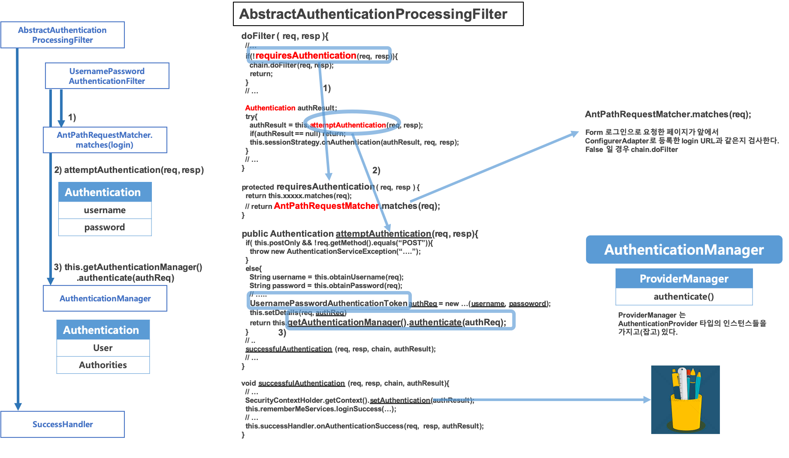

# 스프링 시큐리티 기초 (1) 

참고) 예제로 사용할 환경은 Spring Boot 기반으로 작성함. Spring 설정을 일일히 맞춰가면서 하기에는 시간이 너무 많이 걸리기 때문이다.  

 

# 1. 의존성 추가

## pom.xml

```xml
<dependency>
  <groupId>org.springframework.boot</groupId>
  <artifactId>spring-boot-starter-security</artifactId>
</dependency>
```


## 의존성 추가 후의 자동으로 제공되는 동작

메이븐 라이브러리 추가 후 re import 하고나면 아무런 작업을 하지 않아도, 서버를 구동시키고 나면 시큐리티의 초기화/보안설정 작업이 모두 마무리 된다.  

- 모든 요청은 인증이 되어야 자원에 접근이 가능하다.
- 제공되는 로그인 방식
  - 폼 로그인 방식
  - http Basic 방식
- 기본 로그인 페이지가 jar 파일 내에서 기본 제공된다.
- 디폴트로 제공되는 계정이 있다.
  - username 
    - user
  - password
    - 랜덤으로 생성한 문자열


# 2. WebSecurityConfigurerAdapter

WebSecurityConfigurerAdapter 클래스는 스프링 시큐리티를 처음 공부할 때 가장 기본이 되는 클래스이다. 이 클래스를 상속받은후 몇 가지의 메서드(configure() 등등)들을 @Override 하여 사용하는 편이다.   

이 오버라이드 하는 메서드들은 대체로 HttpSecurity 객체를 전달받는다.  HttpSecuirty 객체는 그림에서 보듯이 그 기능이 매우 다양하고 강력하다.  


# 3. Filter 에서 시작되는 기본 인증 흐름


  




