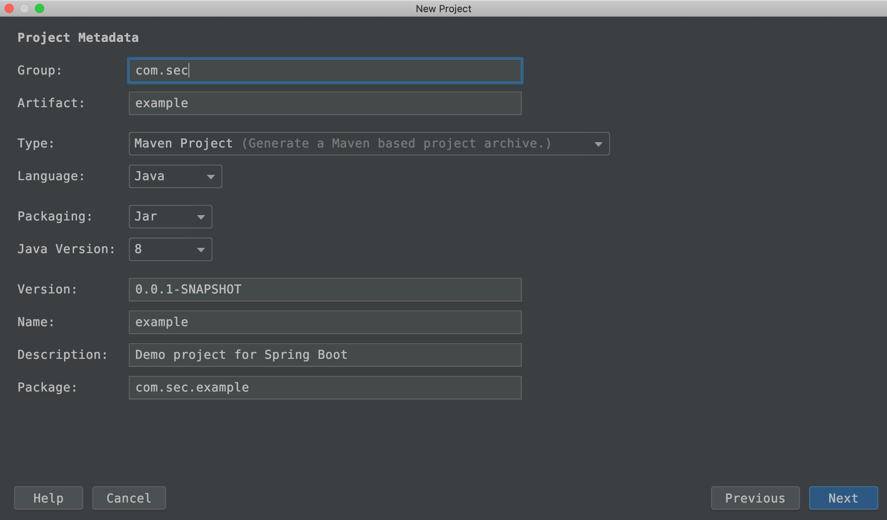

# Security 튜토리얼 (1)


# 1. 프로젝트 생성

이것 저것 다 귀찮다. 샘플 플젝이므로 Spring Initializr 를 사용했다.




# 2. 샘플 페이지 생성


## 뷰 페이지들 역할 

html 페이지를 세개 만들 예정이다.

- index.html

  - index.html 페이지는 루트 페이지

  - 여기서 

    - /home 
    - /welcome

    으로의 이동을 담당하는 a 태그를 생성해놓는다.

- home.html

  - 인증을 받은 사용자, 즉, 로그인 한 사용자만 접근 가능

- welcome.html

  - 인증을 받지 않아도, 모든 사용자가 접근할 수 있다.


## 의존성 추가

뷰단에서 thymeleaf를 사용할 것이므로 thymeleaf 의존성을 추가한다.

**pom.xml**

```xml
    <dependency>
      <groupId>org.springframework.boot</groupId>
      <artifactId>spring-boot-starter-thymeleaf</artifactId>
    </dependency>
```


## html 파일들

index.html  

(src/main/resources/templates/index.html)

```html
<!DOCTYPE html>
<html lang="en">
<head>
  <meta charset="UTF-8">
  <title>Index</title>
</head>
<body>
<h1>Index Page ... </h1>
<a href="/welcome">welcome </a>
&nbsp;&nbsp;
<a href="/home">Home</a>
</body>
</html>
```

home.html  

(src/main/resources/templates/index.html)

```html
<!DOCTYPE html>
<html lang="en">
<head>
  <meta charset="UTF-8">
  <title> Home </title>
</head>
<body>
<h1> 로그인 하셨군요!!! </h1>
</body>
</html>
```

welcome.html  

(src/main/resources/templates/index.html)

```html
<!DOCTYPE html>
<html lang="en">
<head>
  <meta charset="UTF-8">
  <title> WELCOME </title>
</head>
<body>
<h1> 환영합니다!!!  </h1>
</body>
</html>
```


# 3. Controller 추가

HomeController.java라는 이름으로 자바파일을 하나 생성하자. HomeController.java에 index, home, welcome 페이지들에 대한 RequestMapping을 추가해준다.

```java
package com.sec.example.web;

import org.springframework.stereotype.Controller;
import org.springframework.web.bind.annotation.GetMapping;

@Controller
public class HomeController {

	@GetMapping("/")
	public String index(){
		return "index";
	}

	@GetMapping("/home")
	public String home(){
		return "home";
	}

	@GetMapping("/welcome")
	public String welcome(){
		return "welcome";
	}
}
```


# 4. Security 의존성 추가

```xml
    <dependency>
      <groupId>org.springframework.boot</groupId>
      <artifactId>spring-boot-starter-security</artifactId>
    </dependency>
```


톰캣을 구동시켜보자. http://localhost:8080 에 접속하면 기본 로그인 페이지가 나타난다.


별다른 작업(login 페이지에 대한 requestMapping, login 페이지 html 추가 등등)을 하지 않으면 target에 지정된 login.html 페이지를 출력한다. 자동 설정에 되있는 것으로 보인다.

# 5.Security 설정

SecurityConfig.java

```java
package com.sec.example.config;

import org.springframework.context.annotation.Configuration;
import org.springframework.security.config.annotation.web.builders.HttpSecurity;
import org.springframework.security.config.annotation.web.configuration.WebSecurityConfigurerAdapter;

@Configuration
public class SecurityConfig extends WebSecurityConfigurerAdapter {

	@Override
	protected void configure(HttpSecurity http) throws Exception {
		http.authorizeRequests() 	// http 요청을 Authorizing 하겠다.
				// Authorizing 할때 AntMatcher로 /, /welcome은 허용하겠다.
				.antMatchers("/", "/welcome").permitAll()
				// 그 외의 어떤 요청이든 Authorizing(인증)을 하겠다.
				.anyRequest().authenticated()
			.and() // 세부설정을 하고 난 후 다시 HttpSecurity 객체를 받아오기 위한 and 구문
				.formLogin()	
			.and() // 세부설정을 하고 난 후 다시 HttpSecurity 객체를 받아오기 위한 and 구문
				.httpBasic();
	}
}

```

여기까지는 

- welcome.html
- index.html 

페이지는 로그인 없이 접속 가능하다.


# 6. 기본 jpa 로직 추가

## 의존성 추가(h2, data-jpa)

```xml
    <dependency>
      <groupId>org.springframework.boot</groupId>
      <artifactId>spring-boot-starter-data-jpa</artifactId>
    </dependency>

    <dependency>
      <groupId>com.h2database</groupId>
      <artifactId>h2</artifactId>
    </dependency>
```


## Entity, Repository

### Entity

UserModel라는 이름의 클래스를 생성하고 Entity로 등록하자.

```java
package com.sec.example.auth;

import javax.persistence.Entity;
import javax.persistence.GeneratedValue;
import javax.persistence.Id;

@Entity
public class UserModel {

	@Id @GeneratedValue
	private Long id;

	private String username;

	private String password;

	public Long getId() {
		return id;
	}

	public void setId(Long id) {
		this.id = id;
	}

	public String getUsername() {
		return username;
	}

	public void setUsername(String username) {
		this.username = username;
	}

	public String getPassword() {
		return password;
	}

	public void setPassword(String password) {
		this.password = password;
	}
}
```


### Repository

UserModelRepository.java

```java
package com.sec.example.auth;

import java.util.Optional;
import org.springframework.data.jpa.repository.JpaRepository;

public interface UserModelRepository extends JpaRepository<UserModel, Long> {

	Optional<UserModel> findByUsername(String username);
}

```


# 7. UserDetailService 구현

- @Service 어노테이션이 있으면서
- UserDetailsService를 implements한 

클래스가 존재하면, 스프링 부트의 시큐리티 자동 설정을 거치지 않고 우리가 구현한 시큐리티 로직을 타게 된다.  

UserDetailsService 인터페이스에는 

- loadUserByUsername(String username)

이라는 메서드가 존재한다. 이 메서드를 구현해주면, 인증 요청 발생시 SecurityConfig에서 UserDetailsService 타입의 클래스인  UserAuthService를 찾아 loadUserByUsername을 실행한다.


1. loadUserByUsername을 구현
2. createUser() 메서드 생성


**UserAuthService.java**

```java
package com.sec.example.auth;

import java.util.Arrays;
import java.util.List;
import java.util.Optional;
import org.springframework.beans.factory.annotation.Autowired;
import org.springframework.security.core.authority.SimpleGrantedAuthority;
import org.springframework.security.core.userdetails.User;
import org.springframework.security.core.userdetails.UserDetails;
import org.springframework.security.core.userdetails.UserDetailsService;
import org.springframework.security.core.userdetails.UsernameNotFoundException;
import org.springframework.stereotype.Service;

@Service
public class UserAuthService implements UserDetailsService {

	@Autowired
	private UserModelRepository userModelRepository;

	@Override
	public UserDetails loadUserByUsername(String username) throws UsernameNotFoundException {
		Optional<UserModel> user = userModelRepository.findByUsername(username);
		UserModel matchedUserModel = user.orElseThrow(()->new UsernameNotFoundException(username));

		String matchedUserName = matchedUserModel.getUsername();
		String matchedUserPw = matchedUserModel.getPassword();

		List<SimpleGrantedAuthority> authorities
			= Arrays.asList(new SimpleGrantedAuthority("ROLE_USER"));

		return new User(matchedUserName, matchedUserPw, authorities);
	}

	public UserModel createUser(String username, String password){
		UserModel userModel = new UserModel();
		userModel.setUsername(username);
		userModel.setPassword(password);
		return userModelRepository.save(userModel);
	}

}
```


# 8. 샘플 유저 생성

사용자가 있는지 없는지 확인후 인가를 해줄지 결정하는 로직이 필요하다. 사용자가 있어야 인가작업에 대한 확인을 할 수 있다. 따라서 샘플 유저를 생성하는데, 실 DB를 미리 세팅하기에는 글이 너무 길어진다. 따라서 Java에서 직접 생성해 테스트해보자.  


**FakeUserModelRunner.java**

```java
package com.sec.example.config;

import com.sec.example.auth.UserAuthService;
import com.sec.example.auth.UserModel;
import org.springframework.beans.factory.annotation.Autowired;
import org.springframework.boot.ApplicationArguments;
import org.springframework.boot.ApplicationRunner;
import org.springframework.stereotype.Component;

@Component
public class FakeUserModelRunner implements ApplicationRunner {

	@Autowired
	UserAuthService userAuthService;

	@Override
	public void run(ApplicationArguments args) throws Exception {
		UserModel userModel = userAuthService.createUser("elephant", "1111");
		System.out.println(userModel.getUsername() + ", " + userModel.getPassword());
	}
}
```

여기 까지 진행했더라도 로그인이 잘 안된다. 패스워드 인코딩으로 DB에 저장해야 한다. 

# 9. PasswordEncoder

1. PasswordEncoder를 생성하는 빈 추가  
2. UserAuthService 내의 저장로직 수정  
   UserAuthService 내에 UserModel 저장시 Encode해 저장하도록 수정

### 1. PasswordEncoder 생성하는 빈 추가

```java
package com.sec.example.config;

import org.springframework.context.annotation.Bean;
import org.springframework.context.annotation.Configuration;
import org.springframework.security.config.annotation.web.builders.HttpSecurity;
import org.springframework.security.config.annotation.web.configuration.WebSecurityConfigurerAdapter;
import org.springframework.security.crypto.factory.PasswordEncoderFactories;
import org.springframework.security.crypto.password.PasswordEncoder;

@Configuration
public class SecurityConfig extends WebSecurityConfigurerAdapter {
  // ... 

  // 이 부분이 추가되었다.
	@Bean
	public PasswordEncoder passwordEncoder(){
		return PasswordEncoderFactories.createDelegatingPasswordEncoder();
	}
}
```


### 2. UserAuthService 내의 저장로직 수정

```java
package com.sec.example.auth;

import java.util.Arrays;
import java.util.List;
import java.util.Optional;
import org.springframework.beans.factory.annotation.Autowired;
import org.springframework.security.core.authority.SimpleGrantedAuthority;
import org.springframework.security.core.userdetails.User;
import org.springframework.security.core.userdetails.UserDetails;
import org.springframework.security.core.userdetails.UserDetailsService;
import org.springframework.security.core.userdetails.UsernameNotFoundException;
import org.springframework.security.crypto.password.PasswordEncoder;
import org.springframework.stereotype.Service;

@Service
public class UserAuthService implements UserDetailsService {

	@Autowired
	private UserModelRepository userModelRepository;

  // 빈으로 등록한 PasswordEncoder 주입
	@Autowired
	private PasswordEncoder passwordEncoder;

	// ...
  
	public UserModel createUser(String username, String password){
		UserModel userModel = new UserModel();
		userModel.setUsername(username);
		userModel.setPassword(passwordEncoder.encode(password)); // 이 부분이 변경되었다.
		return userModelRepository.save(userModel);
	}

}
```


# 10. 로그인 확인

로그인을 해보자. FakeUserApplicationRunner로 생성한

- elephant
- 1111

로 로그인 하면 된다.  

아래와 같은 페이지가 나온다면 성공이다.


# 11. 다음 계획

- 시큐리티_튜토리얼2에서는 
  - 회원가입 페이지, 회원 추가 로직
    - 회원가입 페이지는 welcome에 추가할 생각이다.
    - 필요하다면 welcome.html, url 매핑을 바꿀생각
- 시큐리티_튜토리얼3 에서는 
  - 로그인 페이지 (/login), 로그인 요청 커스터마이징

를 만들어볼계획이다.  

이후에는 딱히 정해진 계획은 아니지만 생각해보는 것들은 

- 로그인 페이지에서 인증요청 보낼때의 보안방식 고려
- jwt 인증 해보기

를 해볼 생각이다.

