# 1. 코틀린 언어

코틀린은 인텔리제이를 만든 Jetbrain 에서 만든 프로그래밍 언어다. 인텔리제이 역시 코틀린을 완벽 지원하고 안드로이드 스튜디오 역시 코틀린을 완벽하게 지원한다. 구글에서도 코틀린을 자바에 이어 안드로이드 공식 언어로 선언했다.

코틀린은 자바를 대체하는 언어다. 안드로이드 계열에서 사용하는 Java는 Java6 이후의 버전중 Java8 의 일부 기능만을 사용할 수 있다. Java8 기능을 사용하는 것은 Target API를 24 이상으로 설정했을 때에만 사용가능한 기능들이 많다.

하지만 코틀린을 사용하면 최신 언어들에서 제공하는 장점들을 안드로이드 버전에 관계 없이 사용가능하다.

- 호환성
  - 코틀린은 JDK6와 완벽하게 호환가능하다.
  - 구형 안드로이드 기기 지원이 된다는 점은 코틀린을 사용하는 장점이다.
  - 안드로이드 스튜디오에서 지원이 되는 언어이기 때문에 안드로이드의 빌드 시스템과도 완벽히 호환된다.
- 성능
  - 코틀린은 자바만큼 빠르다는 이야기가 아주 많다.

# 2. 코틀린 언어를 REPL 및 에디터에서 실행해보기

## 1) Intellij 에서 사용해보기

### Intellij REPL

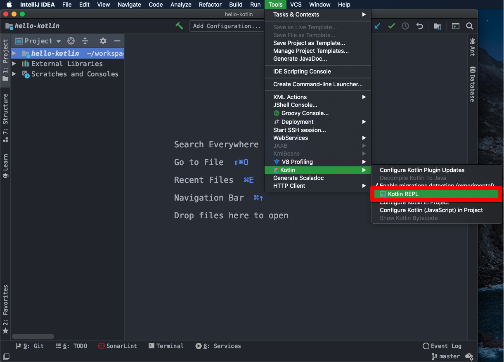


println("hello kotlin")을 REPL 창에 입력하고 Cmd + Enter  

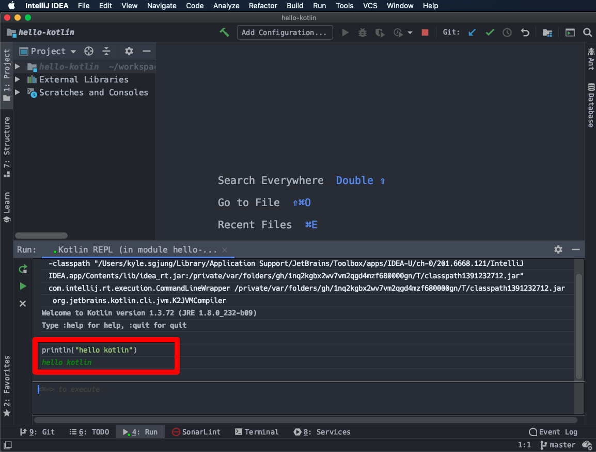


### Scratch File

File > New > Scratch File

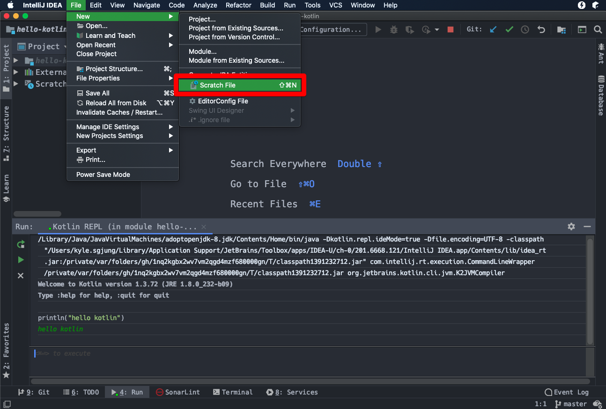


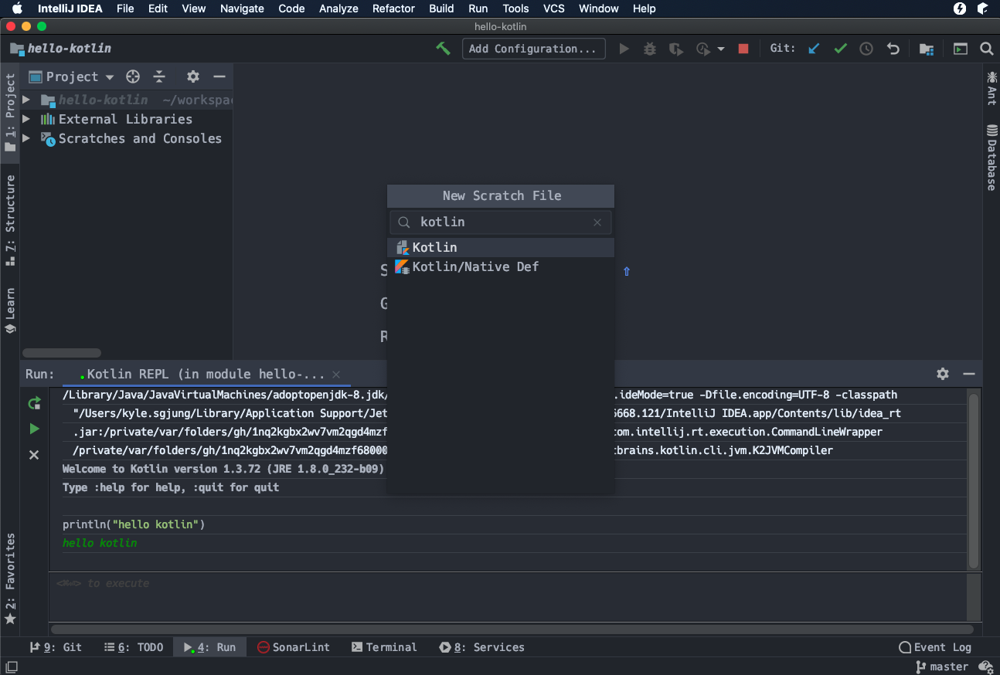


좌측은 에디터, 우측은 출력결과화면이다.  

Cmd + Enter 를 누르면 출력결과를 확인가능하다.

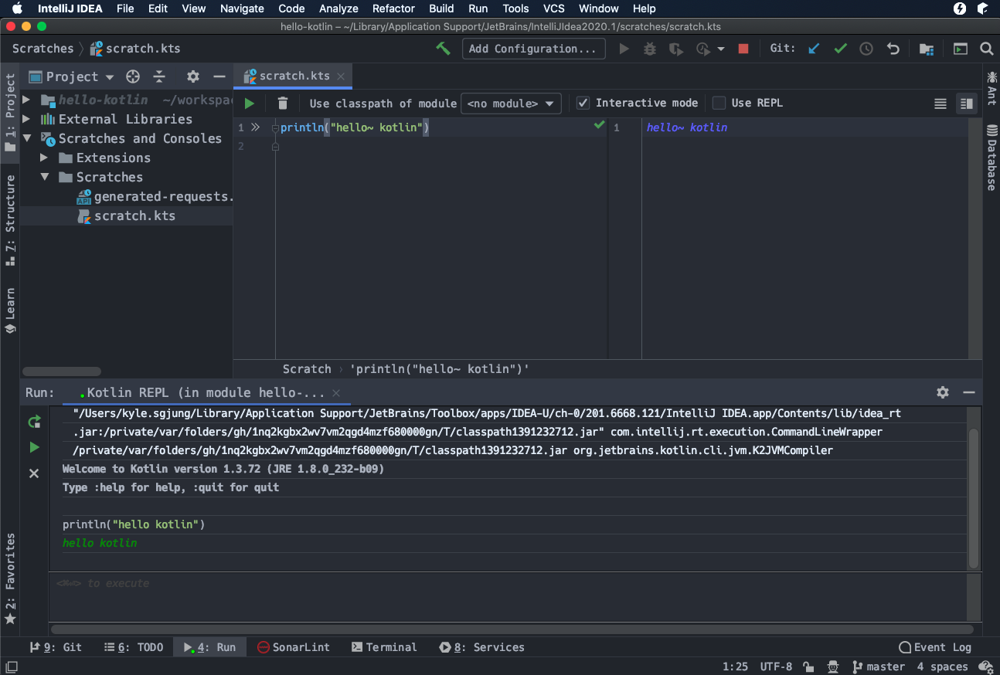


## 2) Android Studio 에서 사용해보기

### Android Studio REPL

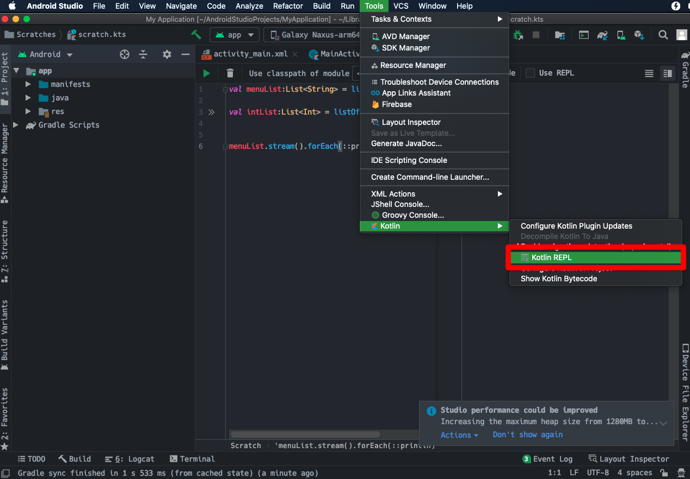


### Scratch File

File > New > Scratch File

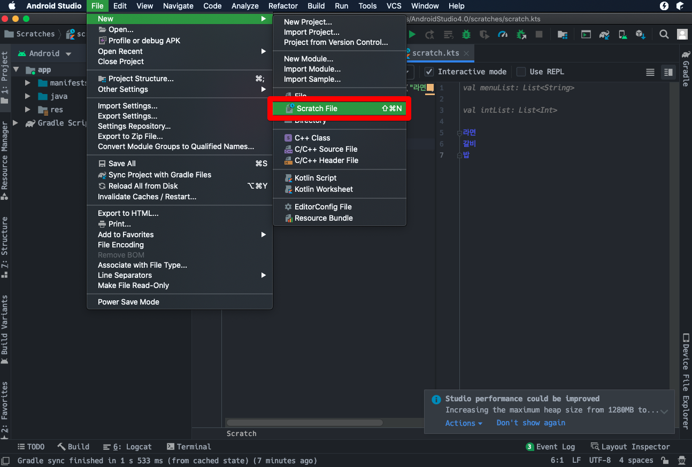


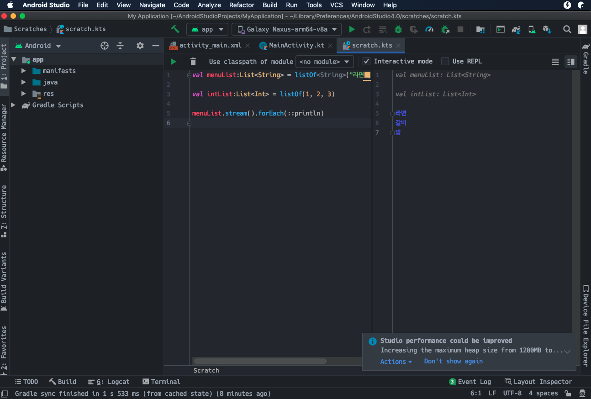


### 스크래치 파일 확인, 삭제

프로젝트 뷰 > Android 로 선택되어있는데, 드랍다운 메뉴 클릭

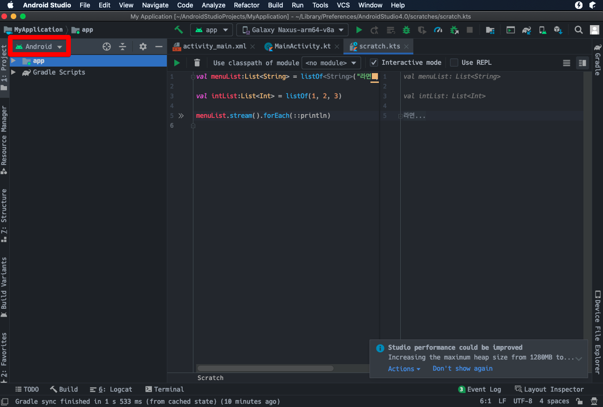


드랍다운 메뉴에서 'Project' 선택

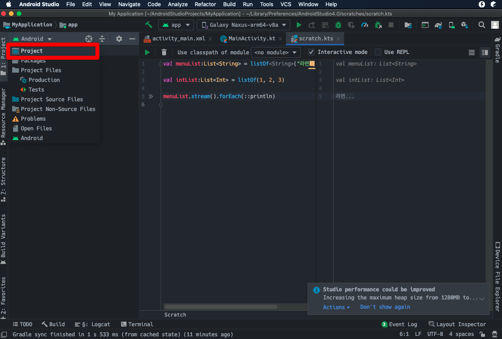


Scratch 파일이 있는 것을 확인가능하다.  

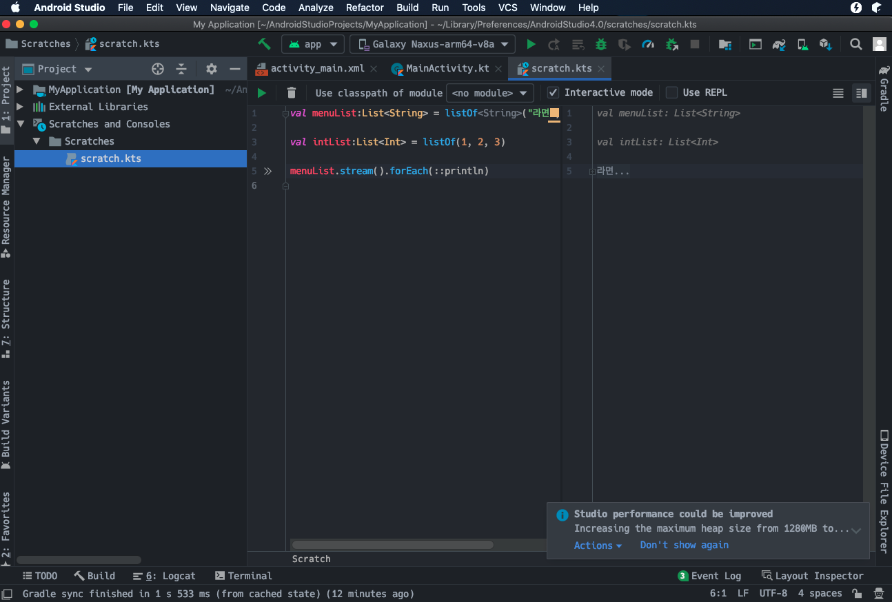


지우고 싶다면 마우스 오른쪽 버튼 클릭 > Delete

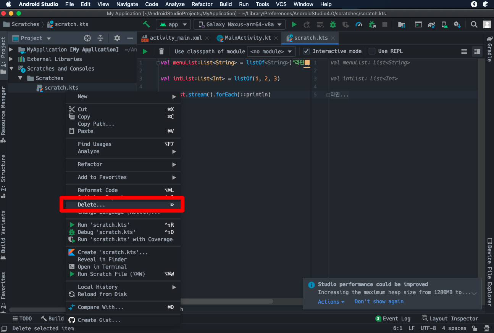


# 3. 변수와 상수

- var 
  - var 는 변수를 선언할 때 사용되는 키워드이다.
  - var 로 선언한 변수는 값을 변경할 수 있다.
- val
  - val 는 상수를 선언할 때 사용되는 키워드이다.
  - val 로 선언한 상수는 값을 변경불가하다.

```kotlin
var a100:Int = 100      // 변수의 선언
val a200:Int = 200      // 상수의 선언
                        // java 의 final 과 같은 역할

a100 += 1       // var 은 값 변경 가능
//a200 += 2     // Val cannot be reassigned
```


# 4. 함수(메서드)

형식 

- fun 함수명 ( 인자1 : 자료형1, 인자2 : 자료형2, … ) : 반환자료형

```kotlin
fun welcome (msg : String) : Unit {
    println("$msg, welcome !!")
}

welcome("안녕하세요~ ")
```


출력결과

```
안녕하세요~ , welcome !!
```


# 5. 기본자료형

## 1) 숫자형

코틀린에서 숫자를 표현하는 자료형들은 아래와 같다.

- Double
- Float
- Long
- Int
- Short
- Byte


```kotlin
var a:Int       = 10
var b:Long      = 10L
var c:Double    = 10.0
var d:Float     = 10.0f

println("Int type value of 'a' is ...       $a")
println("Long type value of 'b' is ...      $b")
println("Double type value of 'c' is ...    $c")
println("Float type vlaue of 'd' is ...     $d")

var aa = 10         // Int
var bb = 10L        // Long
var cc = 10.0       // Double
var dd = 10.0f      // Float

println("Int type value of 'a' is ...       $aa")
println("Long type value of 'b' is ...      $bb")
println("Double type value of 'c' is ...    $cc")
println("Float type vlaue of 'd' is ...     $dd")
```


출력결과

```
Int type value of 'a' is ...       10
Long type value of 'b' is ...      10
Double type value of 'c' is ...    10.0
Float type vlaue of 'd' is …     10.0

Int type value of 'a' is ...       10
Long type value of 'b' is ...      10
Double type value of 'c' is ...    10.0
Float type vlaue of 'd' is ...     10.0
```


## 2) 문자형

```kotlin
var str1:String = "안녕하세요"
var chr1:Char = '안'

println("String type of value str1 is ... $str1")
println("Char   type of value chr1 is ... $chr1")

var str2 = "안녕하세요"
var chr2 = '안'

println("String type of value str2 is ... $str2")
println("Char   type of value chr2 is ... $chr2")
```


출력결과

```
String type of value str1 is ... 안녕하세요
Char   type of value chr1 is ... 안

String type of value str2 is ... 안녕하세요
Char   type of value chr2 is ... 안
```


문자열 여러줄 표현하기

```kotlin
var longStr = """안녕하세요
    문자열 여러줄 출력을 테스트해봅시다
    고고싱~!!
"""
println("longStr : $longStr")
```


출력결과

```
longStr : 안녕하세요
    문자열 여러줄 출력을 테스트해봅시다
    고고싱~!!
```


문자열 템플릿

```kotlin
// Java Style
val koreanMsg = "안뇽하세용"
println(koreanMsg + "헤헤")

// 코틀린
println("$koreanMsg 헤헤")
println("${koreanMsg}헤헤")
```

출력결과

```
안뇽하세용헤헤

안뇽하세용 헤헤
안뇽하세용헤헤
```


## 3) 배열

배열의 타입은 코틀린에서 Array\<T\> 이다. Array라는 타입을 코틀린 컴파일러가 충분히 유추할 수 있는 상황이라면 충분히 생략할 수 있다.  

배열의 생성은 arrayOf()라는 함수를 사용하여 배열을 생성과 초기화를 한번에 수행할 수 있다.  

```kotlin
val numbers1 : Array<Int> = arrayOf(1,2,3,4,5)
var numbers2 = arrayOf(1,2,3,4,5)
```


# 6. 조건문/제어문/반복문 (if/when/for/while)

if ~ else if ~ else 구문의 경우 보통의 언어들과 같이 if ~ else if ~ else 를 사용한다. switch ~ case 구문의 경우 when 구문을 사용한다. 마치 SQL의 SELECT ~ WHEN 구문을 사용하는 것 같은 기분이 든다. 반복문은 보통의 평범한 프로그램 언어들 처럼 for, while을 사용한다. do ~ while이 있는지는 찾아봐야 알 것 같다.  

코틀린의 특이하면서 마음에 드는 점은 조건식을 하나의 람다처럼 식으로 변수에 저장할 수 있다는 점이다.  

주의해서 알고 있어야 하는 점이 하나 있다. kotlin 에서는 삼항연산자를 사용하지 못한다. ?이 null 관련 연산으로 예약되어있어서 언어의 설계상 컴파일러가 우선순위 등을 판정하는데 어려움이 있었던 것 같다.  

코틀린에서는 다른 언어에서 제공하는 while, do ~ while 문을 동일하게 제공한다.   

## 1) if 

### if 문 사용해보기

```kotlin
var odd1 = 9
var isOdd1 = odd1%2 == 1

if(isOdd1){
    println("홀수입니다~!!")
}
else{
    println("짝수입니다~!!")
}
```


### if 문을 식으로 사용해보기

```kotlin
var a = 7
var b = 2
var bigger = if (a > b) a else b
var smaller = if (a > b) b else a
```


## 2) when

### when 절 사용해보기

```kotlin
val NUMBER_ONE : Int    = 1
val NUMBER_TWO : Int    = 2
var NUMBER_THREE : Int  = 3

fun printNumber (input : Int){
    when(input){
        NUMBER_ONE -> println("number_one !!! $input")
        NUMBER_TWO -> println("number_two !!! $input")
        NUMBER_THREE -> println("number_three !!! $input")
        else -> {
            println("숫자 1,2,3 외의 숫자입니다")
        }
    }
}

printNumber(NUMBER_ONE)
printNumber(NUMBER_TWO)
printNumber(NUMBER_THREE)
```


### when 절을 식처럼 사용해보기

```kotlin
al NUMBER_ONE : Int    = 1
val NUMBER_TWO : Int    = 2
var NUMBER_THREE : Int  = 3

var numberTest = NUMBER_ONE

var testNumber = when (numberTest){
    NUMBER_ONE -> println("number_one !!! $numberTest")
    NUMBER_TWO -> println("number_two !!! $numberTest")
    NUMBER_THREE -> println("number_three !!! $numberTest")
    else -> {
        println("숫자 1,2,3 외의 숫자입니다")
    }
}

testNumber
```


출력결과

```
number_one !!! 1
```


### when 절의 결과를 함수의 반환값으로 사용해보기

```kotlin
val NUMBER_ONE : Int    = 1
val NUMBER_TWO : Int    = 2
var NUMBER_THREE : Int  = 3

fun printNumberN1 (testNumber : Int)  = when (testNumber){
    NUMBER_ONE -> println("number_one !!! $testNumber")
    NUMBER_TWO -> println("number_two !!! $testNumber")
    NUMBER_THREE -> println("number_three !!! $testNumber")
    else ->{
        println("숫자 1,2,3 외의 숫자입니다.")
    }
}

printNumberN1(NUMBER_ONE)


fun printNumberN2 (testNumber : Int)  {
    return when (testNumber){
        NUMBER_ONE -> println("number_one !!! $testNumber")
        NUMBER_TWO -> println("number_two !!! $testNumber")
        NUMBER_THREE -> println("number_three !!! $testNumber")
        else ->{
            println("숫자 1,2,3 외의 숫자입니다.")
        }
    }
}

printNumberN2(NUMBER_TWO)

fun isOdd (testNumber : Int) : Boolean{
    return when (testNumber%2) {
        0 -> false
        1 -> true
        else -> {
            return false
        }
    }
}

println("the number $NUMBER_THREE is odd ? ${isOdd(NUMBER_THREE)}")
```


출력결과

```
number_one !!! 1
number_two !!! 2
the number 3 is odd ? true
```


## 3) for

일반적인 프로그래밍 언어에서 제공해주는 키워드인 for 언어와 사용법이 비슷할수도 있지만, step을 지정하는 부분이 조금 다르다.  

### 배열 순회하기

```kotlin
val numbers = arrayOf(1,2,3,4,5,6,7,8,9,10)
var sum = 0

for (n in numbers){
    sum +=n
}

println("sum of numbers is $sum")
```


### 출력결과

```
sum of numbers is 55
```


### 숫자 반복하기

#### 1..10 까지의 합을 구해보기

```kotlin
var sum2 = 0
for (i in 1..10){
    sum2 += i
}

println("sum of 1..10 is $sum2")
```


출력결과

```
sum of 1..10 is 55
```


#### 1..10 사이에서 홀수의 합을 구해보기

```kotlin
var sum3 = 0
for (i in 1..10 step 2){
    sum3 += i
}

println("sum of 1..10 step 2 is $sum3")
```


출력결과

```
sum of 1..10 step 2 is 25
```


#### 10 ~ 0 까지 3씩 감소하면서 출력해보자.

```kotlin
for (i in 10 downTo 0 step 3){
    println("i is ${i}...")
}
```


출력결과

```
i is 10...
i is 7...
i is 4...
i is 1...
```


## 4) while

코틀린에서는 다른 언어에서 제공하는 while, do ~ while 문을 동일하게 제공한다.

```kotlin
println("### test1 ###")
var i = 0
while(i >= 10){
    i++
    println(i)
}

println("### test2 ###")
var ii = 0
do {
    i++
    println(ii)
}while(ii >= 10)

println("### test3 ###")
var iii = 0
while (iii < 10){
    iii++
    println(iii)
}
```


출력결과

```
### test1 ###

### test2 ###
0

### test3 ###
1
2
3
4
5
6
7
8
9
10
```


# 7. 클래스

## 1) 클래스 선언

클래스를 단순하게 선언하는 것은 어렵지 않다. 다만 new 키워드를 코틀린에서는 사용하지 않는 다는점이 조금은 불편하게 다가올수도 있을것 같다.

```kotlin
class Fruit {

}

val fruit = Fruit()
```


## 2) 생성자 - TODO 다시 정리 필요(코틀린책 보고 조금 자세히 정리 필요)

### 간단한 구조의 생성자

```kotlin
class Fruit (var weight : Double){

}
```

constructor 구문에서 초기화 구문을 작성할 수 있다. (TODO 정리필요)

```kotlin
class Fruit {
    constructor(weight: Double){
        println(weight)
    }
}
```

constructor 구문이 하나일 경우 이것을 primary constructor로 변환하라는 경고문구가 나타난다. primary constructor라는 것이 init{…} 을 가리키는 것인가 보다. primary constructor를 사용하는 구문으로 변경한 것은 아래와 같다.

```kotlin
class Fruit(weight: Double) {
    init {
        println(weight)
    }
}
```


## 3) 프로퍼티 (TODO 다시 정리 필요)

클래스의 멤버필드를 주로 프로퍼티라고 하는 듯 하다. 멤버필드에 getter/setter로 접근할수도 있지만, 코틀린에서는 주로 메서드 없이 바로 점(멤버 참조 연산자)을 찍고 프로퍼티에 접근하는 듯해보인다.  

```kotlin
// 생성자와 함께 클래스를 선언
class Fruit (var weight: Double){
}

// 생성자를 이용한 객체생성 (1)
val banana : Fruit = Fruit(0.1)
println("weight of an banana is ${banana.weight} kg")

// 생성자를 이용한 객체생성 (2) : weight 프로퍼티(=필드)를 명시적으로 지정해 초기화했다.
val apple : Fruit = Fruit(weight = 0.2)
println("weight of an apple is ${apple.weight} kg")

// 프로퍼티(=멤버 필드) 접근시 getter/setter 없이 접근 가능하다.
apple.weight = 0.15
println("weight of an apple is ${apple.weight} kg")
```

생성자에 인자가 많을 때는 Fruit(weight = 0.2) 와 같은 식을 이용해 인자를 지정해주는 것 역시 가능하다. (Java 외의 거의 대부분의 언어에서 지원하는 기능)  

출력결과

필드에 직접 접근해 apple의 weight을 변경한 결과가 제대로 반영된 것을 확인 가능하다.

```
weight of an banana is 0.1 kg
weight of an apple is 0.2 kg
weight of an apple is 0.15 kg
```


## 4) 접근제한자

변수, 함수의 접근 범위를 지정할 때 사용하는 키워드

- public

  - 전체공개

- private

  - 현재 파일 내에서만 사용가능

- internal

  - 같은 모듈 내에서만 사용가능
  - 예를 들어 app 모듈 내에 tv, smartphone, watch 모듈이 있고, app 모듈 내에 Fruit 클래스 내에 internal로 선언한 필드 weight 이 있다면, tv, smartphone, watch 모듈에서 모두 weight 필드에 접근 가능하다.

- protected

  - 상속받은 클래스에서 사용할 수 있다.

  

```kotlin
open class Fruit{
    val name = "전체공개"   // 아무 키워드도 주지 않으면 기본적으로 public 으로 세팅
    private val vendor:String = "두콩상회"
    protected val vender1:String = "두콩상회(protected)"
    internal val vender2:String = "두콩상회(internal)"

    fun getVender1():String {
        return vender1
    }
}

class Apple : Fruit() {
    fun get_vender1() : String {
        return vender1
    }
}

val aFruit : Fruit = Fruit()
val anApple : Apple = Apple()

// public 멤버 접근
println(aFruit.name)

// private 멤버 접근
//println(aFruit.vender) // 컴파일 에러
println(aFruit.getVender1())

// protected 멤버 접근
// 확장클래스(상속받은 클래스)에서 protected 멤버인 vender1 에 접근
println(anApple.get_vender1())

// internal 멤버 접근 
// 확장클래스(상속받은 클래스)에서 internal 멤버인 vender2 에 접근
println(anApple.vender2)
```


## 5) 클래스 상속

코틀린에서 클래스는 기본적으로 상속이 금지되도록 되어있다고 한다. 상속을 가능하도록 허용하려면 open 키워드를 클래스 선언 앞에 추가한다. 어쩌면 이런 방식이 조금 더 명확해서 다른 클래스에서 상속하고 있다는 것을 보여줄 수 있는 장점이 될수도 있는 것 같다.   

하지만 어떤 면에서는 라이브러리(예를 들면 resilience4j) 등을 만드는 설계자들의 입장에서는 기존에 만들었던 클래스를 상속하고자 할 때 open 키워드를 새로 추가하게 되어 구버전과 신버전사이의 호환이 어려워지도록 할 수 있다는 단점 또한 있는 듯 하다.  

 

```kotlin
open class Fruit{}
class Apple : Fruit(){}

open class Person(var name : String)
class Student(var grade : Int) : Person("Jordan")
```


## 6) 내부 클래스

다른 언어들에서와 같이 클래스 내부에 클래스를 선언하는 것을 내부클래스라고 한다. 내부 클래스 선언시 inner 키워드를 사용한다.

```kotlin
class Student {
    var name : String = "Jordan"

    init{
        println("My name is $name")
    }

    inner class Personality {
        fun doSomething() : Unit {
            name += ", He is Chicago Bulls No.23 Basketball Start"
            println(name)
        }
    }
}

val student : Student = Student()
student.Personality().doSomething()
```

출력결과

```
My name is Jordan
Jordan, He is Chicago Bulls No.23 Basketball Start
```


## 7) 추상클래스

추상 클래스는 미구현 메서드를 포함하는 클래스다. java 에서 지원하는 abstract 키워드와 같은 역할을 한다. 클래스와 미구현 메서드 앞에 abstract 키워드를 붙인다. 추상 클래스는 직접 인스턴스화 할 수 없고 다른 클래스에서 직접 상속(확장)해서 미구현 메서드를 구현해야 한다. 자바에서 지원하는 abstract와 같은 기능이라고 생각하면 된다.  

```kotlin
abstract class Printer {
    abstract fun doPrint(): Printer
    fun sayCategory() : Unit {
        println("This Product is a type of Printer")
    }
}

class LaserPrinter : Printer(){
    override fun doPrint() : Printer {
        println("치직치직~ ... 프린트가 완료되었습니당~")
        return this
    }
}

class InkJetPrinter : Printer(){
    override fun doPrint() : Printer {
        println("위잉위잉~ ... 프린트가 완료되었습니다~")
        return this
    }
}

val laserPrinter : LaserPrinter = LaserPrinter()
val inkJetPrinter : InkJetPrinter = InkJetPrinter()
laserPrinter.doPrint().sayCategory()
inkJetPrinter.doPrint().sayCategory()

val printer : Printer = Printer()           // 에러
                                            // abstract 클래스를 인스턴스로 생성하려 했으므로 에러
var lPrinter : Printer = LaserPrinter()
```


출력결과

```
치직치직~ ... 프린트가 완료되었습니당~
This Product is a type of Printer
위잉위잉~ ... 프린트가 완료되었습니다~
This Product is a type of Printer
```


## 8) 인터페이스

인터페이스는 추상클래스(abstract class)와 언뜻 보면 유사한 점이 많다. 하지만 추상클래스의 경우 하나의 클래스와 유사한 개념이다. 추상클래스가 인터페이스와 다른점은 하나의 클래스에서 여러개의 인터페이스를 구현할 수 있다는 점이다. 추상 클래스의 경우 클래스 개념이기 때문에 하나의 클래스에서 하나의 추상클래스만을 상속받아 구현할 수 밖에 없다.  

java 8 부터 인터페이스는 default 메서드라고 불리는 구현된 메서드를 포함할 수 있게 되었는데 이 개념을 코틀린에서도 역시 사용가능하다.  

```kotlin
interface Eat {
    fun eat() : Eat

    // java 8 부터 인터페이스는 default 메서드라고 불리는 구현된 메서드를 포함할 수 있다.
    fun pay() : Unit {
        println("계산계산~")
    }
}

interface Workout {
    fun workout() : Unit
}

open class Person {
    fun walk() : Unit {
        println("걷는다. ")
    }
}

class Student : Person() ,Eat, Workout {
    override fun eat() : Eat {
        println("학식을 먹는다 하하하")
        return this
    }

    override fun workout() {
        println("홈트 고고싱")
    }
}

val student : Student = Student()
student.walk()
student.eat().pay()
student.workout()
```


출력결과

```
걷는다. 
학식을 먹는다 하하하
계산계산~
홈트 고고싱
```


# 8. null 처리, null 가능성, nullable

코틀린에서는 기본적으로 객체를 불변으로 취급하고 null 값을 허용하지 않는다. null 값을 허용하려면 별도의 연산자를 사용해 초기화한다. null 값이 허용된 자료형을 사용할 때에서 별도의 연산자를 통해 안전하게 호출해야 한다.  

null 이 허용되는 변수를 선언할 때는 ? 와 같이 표현식을 사용하면 null 이 허용되는 대입연산을 수행하게 된다. 예를 들자면 String? 와 String 타입은 엄연히 다르다.  


## 1) ? 연산자 - null 허용

```kotlin
val sample : String          // 에러
val a : String  = null       // 에러
var a : String? = null       // 정상
```


## 2) lateinit 키워드 (var 선언변수의 늦은 초기화)

var 로 선언한 변수를 일단 선언만 해놓고 초기화는 나중에 진행하는 경우 lateinit 키워드를 사용한다. 

공부를 조금 더 해서 정리를 해놓아야 할 것 같다. (TODO 정리 필요)

```kotlin
lateinit var a : String
a = "안녕 세상~"
println(a)

lateinit var b : String
println(b)
```

- var 변수에서만 사용 가능
- null 값으로 초기화할 수 없다.
- 초기화 전에는 변수를 사용할 수 없다.
- int, Long, Double, Float 에는 사용할 수 없다.


## 3) lazy 키워드 (val 선언 변수의 늦은 초기화)

val로 선언한 변수를 일단 선언만 해놓고 초기화는 나중에 진행할 때 사용한다. val 선언뒤에 by lazy 블록에 초기화에 필요한 코드를 작성한다. 마지막줄에는 초기화 할 값을 작성해준다.  

아래 예제에서는 a 라는 상수를 초기화 할 때 println() 으로 "안녕세상~"이라는 문구를 출력하고 있다. 그런데 상수 a는 두번 참조되어 진다. 여기서 처음 참조될 때에만 by lazy {…} 구문내의 초기화 구문이 실행되고 그 이후부터는 초기화구문 없이 값의 반환만을 수행하게 된다.  

```kotlin
val a : String by lazy {
    println("안녕세상~")
    "헬로~"
}

println(a)
println(a)
```

  

참고)

- lateinit
  - var 로 선언한 변수를 늦은 초기화 할 때 사용
- by lazy { … }
  - val 로 선언한 변수를 늦은 초기화 할 때 사용


## 4) null 값이 아님을 보증 (!!)

변수 뒤에 !!을 추가하면 null 값이 아님을 보증하는 것을 의미한다.  

아래의 예제를 보면 name1 의 타입은 String? 이다. String? 타입은 String 타입과 명백히 다르다.  

String? 타입의 변수를 다른 변수에 저장할 때 

- String? 타입의 변수는 String? 타입에 저장하거나
- String? 타입의 변수의 뒤에 !!을 붙여서 String 타입으로 변환시켜주어야 한다.

참고)  

연산자 '!!'가 실제로 String? 을 String 타입으로 변환하는 것과 같은 동작을 하는지는 확실히 모른다. 일단 예제가 이런 예쩨가 있어서 정리해봤다.  

```kotlin
val name1: String? = "과일"
val name2: String  = name1            // 에러
val name3: String? = name1            // 정상
val name4: String  = name1!!          // 정상
```


## 5) 안전한 호출 (?.)

메서드 호출시 . 대신 ?. 연산자를 사용하면 null 값이 아닌 경우에만 호출하게 된다. 아래의 TODO 정리필요

```kotlin
var strHello: String? = null
var upperCase = if (strHello != null) strHello else null
upperCase = strHello?.toUpperCase()
println(upperCase)
```

출력결과

```
null
```


## 6) 엘비스 연산자 '?:'

안전한 호출 키워드인 ?. 을 사용시 null 아닌 기본 값을 반환하고 싶을경우 엘비스 연산자를 함께 사용한다. 

```kotlin
val str: String? = null
var upperCase = if (str != null) str else null
upperCase = str?.toUpperCase() ?: "str 변수는 초기화를 해야만 upperCase() 가 가능합니다."
println(upperCase)
```

출력결과

```
str 변수는 초기화를 해야만 upperCase()가 가능합니다.
```


# 9. 컬렉션

## 1) 리스트

리스트는 배열 또는 java의 리스트와 같은 자료구조다.

- 중복된 아이템을 가질 수 있다.
- 추가/삭제/교체 메서드 등을 제공한다.
- listOf(), mutableListOf() 메서드로 리스트를 생성가능하다.
- listOf는 요소를 변경할 수 없는 읽기 전용 리스트를 생성할 때 사용한다.
- mutableListOof는 요소를 변경할 수 있는 리스트를 작성할 때 사용한다.

자바에서 리스트의 특정 요소에 접근할 때 .get(i)를 사용했는데 코틀린에서는 단순하게 [i]를 통해 접근가능하다.

### listOf

```kotlin
//요소를 변경할 수 없는 읽기 전용 리스트 생성은 listOf() 메서드로 생성
val fwPlayers1: List<String> = listOf("손흥민", "황희찬", "황의조")
//타입 추론으로 자료형을 생략 가능하다.
val fwPlayers2 = listOf("손흥민", "황희찬", "황의조")

println("left wing : ${fwPlayers1[0]}")
```

출력결과

```
left wing : 손흥민
```


### mutableListOf

```kotlin
val fwPlayers2 = mutableListOf("손흥민", "황희찬", "황의조")
fwPlayers2.add("윤종신")

val removed = fwPlayers2.removeAt(2)
println("${removed} was removed.")

fwPlayers2[2] = "황의조"
println("${fwPlayers2[2]} was added")
```

출력결과

```
황의조 was removed.
황의조 was added
```


## 2) 맵

mapOf() 메서드로 읽기 전용 맵 자료를 만들수 있다. mutableMapOf() 메서드로 수정이 가능한 맵을 만들 수 잇다. 대괄호 ([]) 안에 key 를 요소명으로 지정해서 접근가능하다. (마치 javascript와 유사한 쓰임새이다.)

```kotlin
// 읽기전용 맵
val map1 = mapOf("left" to "손흥민", "center" to "헤리케인", "right" to "루카스 모우라")

// 변경가능한 맵
val map2 = mutableMapOf("left" to "손흥민", "center" to "헤리케인", "right" to "루카스 모우라")
println(map2.toString())

map2["center"] = "가레스 베일"
println(map2.toString())

//맵 전체의 키,값을 순회하기
for ((k,v) in map2){
    println("$k : $v")
}
```


출력결과

```
{left=손흥민, center=헤리케인, right=루카스 모우라}
{left=손흥민, center=가레스 베일, right=루카스 모우라}
left : 손흥민
center : 가레스 베일
right : 루카스 모우라
```


## 3) 셋(Set), 집합

Set 은 중복되지 않는 요소들로 구성된 자료구조이다. setOf() 메서드로 읽기 전용 집합을 생성할 수 있고, mutableSetOf() 메서드로 수정가능한 집합을 생성한다.   

```kotlin
val citySet = setOf("손흥민", "헤리 케인", "루카스 모우라")
val citySet2 = mutableSetOf("손흥민", "헤리 케인", "루카스 모우라")

citySet2.add("가레스 베일")
println(citySet2.toString())

citySet2.remove("루카스 모우라")
println(citySet2.toString())

println("size of 'citySet2' is ${citySet2.size}")
println("'citySet2' contains '루카스 모우라' :: ${citySet2.contains("루카스 모우라")}")

citySet2.add("루카스 모우라")
println("'citySet2' contains '루카스 모우라' :: ${citySet2.contains("루카스 모우라")}")
```


출력결과

```
[손흥민, 헤리 케인, 루카스 모우라, 가레스 베일]
[손흥민, 헤리 케인, 가레스 베일]

size of 'citySet2' is 3
'citySet2' contains '루카스 모우라' :: false
'citySet2' contains '루카스 모우라' :: true
```


# 10. 람다식

자바8 만을 이야기해보면, java 8 에서는 람다식을 만들때 interface를 선언해서 사용해왔다. 자바 9 이후의 버전 중에서 람다식 관련된 이야기가 있었는지는 모르겠다. 코틀린에서는 기본으로 함수 자체를 람다식으로 생성하는 것을 지원한다.

  

## 함수 자체를 람다식으로 선언하기

```kotlin
fun addNormal (x: Int, y: Int): Int {
    return x + y
}

fun addByLambda(x:Int, y: Int) = x + y
```


## 1) SAM 변환 (TODO 정리 필요)

코틀린에서는 추상 메서드 하나를 인수로 사용할 때 함수를 인수로 전달할수 있어서 편하다.

자바 기반의 인터페이스 들 중 메서드가 하나인 인터페이스를 구현할 때는 이 것을 람다식으로 변경가능하다.

ex)

```kotlin
button.setOnClickListener( object : View.OnClickListener {
    override fun onClick(v: View?){
        // 클릭 이벤트에 대한 처리
    }
})
```

위의 코드는 아래와 같이 람다식으로 줄여서 표현 가능하다.

```kotlin
button.setOnClickListener({ v:View ? -> 
    println("hello") // 클릭시 처리 … 쓸게 없어서 println 을 입력했다.
})
```

메서드 호출 시 맨뒤(마지막)에 전달되는 인자가 람다식일 경우 람다식을 괄호 바깥으로 빼는것 역시 가능하다. 

```kotlin
button.setOnClickListener { v:View? -> 
    println("hello") // 클릭시 처리
}
```

클릭 Listener 와 같은 리스너 작성시 v 인수를 사용하지 않을 경우 v 라는 이름의 인자는 _ 기호로 대치가능하다. 이건 무슨뜻인지 모르지만 일단 정리 (TODO)

```kotlin
button.setOnClickListener { _ -> 
    // 클릭 시 처리
}
```

람다식에서 인자가 하나인 경우 이를 아예 생략하고 람다 블록 내에서 인수를 it로 접근할 수 있다. 아래 코드에서 it는 View? 타입의 v 인수를 가리킨다.

```kotlin
button.setOnClickListener{
    it.visibility = View.GONE
}
```


# 11. 기타 기능

코틀린 기본 라이브러리는 유용한 함수들을 제공한다. 이에 대해 알아보자.

- 확장함수
  - 원래 있던 클래스에 기능을 추가하는 함수
- 형변환
  - 숫자형 자료형끼리 쉽게 형변환 가능
- 타입 체크
  - 변수의 형이 무엇인지 검사하는 기능
- 고차 함수
  - 인자로 함수를 전달하는 기능
- 동반 객체
  - 클래스의 인스턴스 생성 없이 사용할 수 있는 객체
- let() 함수
  - 블록에 자기 자신을 전달하고 수행된 결과를 반환하는 함수
- with() 함수
  - 인자로 객체를 받고 블록에서 수행된 결과를 반환하는 함수
- apply() 함수
  - 블록에 자기 자신을 전달하고 이 객체를 반환하는 함수
- run() 함수
  - 익명함수 처럼 사용하거나, 블록에 자기 자신을 전달하고 수행된 결과를 반환하는 함수

## 1) 확장함수

기존 클래스에 함수를 추가할 수 있다. [클래스명].[추가하려는 메서드명] 으로 원하는 클래스에 함수를 추가할 수 있다. 확장함수 내에서는 자기 자신이 속한 클래스에 대한 객체를 this로 접근할 수 있고, 이 객체를 리시버 객체라고 부른다.

```kotlin
class Fish(var age:Int, var weight:Double){}
// 확장함수 선언 및 정의
fun Fish.printAge() = println("이 물고기의 나이는 ... ${age}살입니다.")
fun Fish.printWeight() = println("이 물고기의 무게는 ... ${weight}kg 입니다.")

val 고등어:Fish = Fish(100, 10.0)

고등어.printAge()
고등어.printWeight()
```

예제에서는 '고등어’라는 변수를 추가했는데, 한글 변수명이 지원되나 봤는데 지원된다는 점이 신기하기는 하다. 

객체 '고등어’에 printAge(), printWeight() 메서드를 추가했는데, 이렇게 printAge(), printWeight()을 확장함수라고 한다. 컴파일 타임이 아닌 런타임에 어떤 동작을 추가할때 사용하지 않을ㄲ ㅏ싶다.

또 다른 예로 Int 자료형에 대한 예를 살펴보자

```kotlin
fun Int.product1000() = this*1000

val one: Int = 1
val two: Int = 2

println("일천원 : ${one.product1000()}")
println("이천원 : ${two.product1000()}")

//## 고차함수
fun add(x: Int, y: Int, callback: (sum: Int) -> Unit){
    callback(x + y)
}
```

자바에서는 기본 자료형에 기능을 추가하려면 상속을 받고 추가 메서드를 작성해야 했다. String 클래스의 경우 final로 상속이 막혀있어 이 마저도 불가능했다.


## 2) 형변환

- 숫자형 데이터간 형변환
  - 숫자형 자료형 끼리 서로 다른 타입으로 형변환이 가능하다.
  - to[숫자타입종류]() 메서드를 사용한다.
- 문자열을 숫자로 변환시
  - java에서와 같이 Integer.parseInt() 를 사용한다.
  - Long.parseLong(), Double.parseDouble() 이 없다는것은 조금 아쉽긴 하다.
- 일반 클래스 간에 형변환을 할 때는 as 키워드를 사용한다.
  - ex) 고등어 as Fish 


```kotlin
//### 숫자형 데이터간 형변환
val a = 10L
val b = 20

val c = a.toInt()
val d = b.toDouble()
val e = a.toString()

//### 문자열을 숫자로 변환시
val strSeven = "7"
val str = Integer.parseInt(strSeven)

//### 일반 클래스 간에 형변환을 할 때는 as 키워드를 사용한다.
open class SeaFood{}
class Abalone : SeaFood(){} // Abalone 은 '전복'이다.

val abalone = Abalone()
val seafood = abalone as SeaFood
```


## 3) 타입 체크

애플리케이션을 개발하다 보면 타입을 체크해야 하는 경우가 자주 있다. 타입 체크는 is 키워드를 사용한다. java의 instanceOf 키워드와 동일한 역할을 수행한다.

```kotlin
val strMsg: String = "안녕하세용~"
if (strMsg is String){
    println(strMsg)
}
```


## 4) 고차 함수

코틀린에서는 함수의 인자로 함수를 전달할수 있고, 함수를 반환하는 것 역시 가능하다. 이렇게 함수를 인자로 받거나 반환할 수 있는 매개체 역할의 함수를 고차함수(High Order Fucntion)이라고 부른다. react 등을 접해본 사람이라면 고계함수, 고차함수 라는 단어에 익숙할 수 있을 것 같다.  

```kotlin
fun add(x: Int, y: Int, callback: (sum: Int) -> Unit){
    callback(x + y)
}

add(5, 3, { println(it) })
add(5, 3) { println(it) }
```

 

add 함수는 x, y, callback 을 인수로 전달받는다. callback 이라는 인자는 함수타입을 파라미터로 전달받는다. (callback 이라는 이름의 파라미터는 Int를 인자로 받고 Unit을 반환형으로 하는 함수 파라미터이다.) 자바에서는 인터페이스를 이용해 람다식을 반들어 전달하는 편인데, 코틀린에서는 그렇게까지 하지 않아도 된다는 점이 편하다. 거기에 성능까지 빠르니 좋다고 볼수 있다.   

함수는 {} 으로 감싸서 내부에서는 반환값을 it로 접근할 수 있다. 그런데 이렇게 {} 로 감싸는 것은 함수 호출 바깥에서 {}으로 감싸서 함수의 body(몸체)를 구현할 수도 있는 것 같다. 어차피 함수를 리턴하는 함수이기 때문인듯 하다. (IDE에서 권장되는 문법을 추천해준다.)


## 5) 동반 객체

애플리케이션을 개발하다보면 팩토리 메서드를 사용하는 경우가 있다. Fragment 를 사용하게 되는 경우을 예로 들 수 있다. Java에서는 static과 같은 정적인 메서드로 팩토리 메서드를 구현이 가능하다. 하지만 코틀린에서는 static과 같은 정적인 타이핑이 가능한 키워드를 제공하지 않는다.  

코틀린에서는 동반객체(companion object)로 static 키워드와 같은 역할을 수행가능하다. (TODO 이부분 다시 공부가 필요하다.)  

```kotlin
class Fragment {
    companion object {
        fun newInstance(): Fragment {
            println("생성됨")
        }
    }
}

val fragment = Fragment.newInstance()
```


## 6) let() 함수

let() 함수는 블록에 자기 자신을 인수로 전달하고 수행된 결과를 반환한다. 인수로 전달되는 자기 자신은 it로 참조하면 된다. let() 함수는 안전한 호출연산자인 ?. 와 함께 사용하면 null 값이 아닐 때만 실행하는 코드를 아래와 같이 표현 가능하다.  

```kotlin
// fun<T,R> T.let (block: (T) -> R): R
var strNum1: String = "1"
val result:Int = strNum1?.let {
    Integer.parseInt(it)
}
println("let 을 통해 parseInt 한 결과는 ${result} 입니다.\n")
```

출력결과

```
let 을 통해 parseInt 한 결과는 1 입니다.
```


## 7) with() 함수

with() 함수는 인자로 객체를 전달 받는데, 이 객체는 블록 내에 리시버 객체로 전달된다. 그리고 수행된 결과를 리턴(반환)한다. 리시버 객체로 전달된 객체는 this로 접근할 수 있는데, 이 this는 생략이 가능하다. 아래 예제처럼 this를 통한 연산은 모두 this. 을 제거하고 작성해도 된다.

with는 ?. 을 이용한 안전한 호출이 불가능하므로 strWorld가 null 이 아닐 경우에만 사용해야 한다.

```kotlin
// fun<T,R> with (receiver: T, block T.() -> R): R
var strWorld = "world"
with(strWorld){
    println(this.toUpperCase())
    println(toUpperCase())          // this 는 생략이 가능하다.
}
```


출력결과

```
WORLD
WORLD
```


## 8) apply() 함수

apply() 함수는 블록내에 객체 자신이 리시버 객체로 전달된다. 그리고 이 객체가 반환된다. 객체의 상태를 변화시키고 그 객체를 다시 반환할 때 주로 사용된다.

```kotlin
// fun <T> T.apply(block: T.() -> Unit): T
class Fruit (var name : String, var price : Int){}
val f: Fruit = Fruit("APPLE", 1000)
var test = f?.apply{
    f.name = "apple"
    f.price = 1500
}
println("f      = ${f.name}, ${f.price}")
println("result = ${test.name}, ${test.price}")
```

출력결과

```
f      = apple, 1500
result = apple, 1500
```


## 9) run() 함수

run() 함수는 마치 javascript에서 사용하던 즉시실행함수, 익명함수 등의 형식과 비슷해보인다.

- 익명함수 형식으로 사용되는 방식
- 객체 내에서 호출하는 방식

run() 함수는 익명함수처럼 사용하는 방법, 객체에서 호출하는 방법 모두를 제공한다.

### 익명함수처럼 사용하는 벙법

익명함수처럼 사용할 때는 블록의 결과를 반환한다. 블록 안에 선언된 변수는 모두 임시로 사용되는 변수다.

```kotlin
// fun <R> run(block: () -> R): R
var avg = run {
    val kor = 100
    val english = 80
    val math = 50

    (kor + english + math)/3.0
}

println(avg)
```

출력결과

```
76.66666666666667
```


### 객체에서 호출하는 방법

```kotlin
// fun <R> run(block: () -> R): R
var str1: String = "hello"

str1.run{
    println(toUpperCase())
}
```

출력결과

```
HELLO
```

