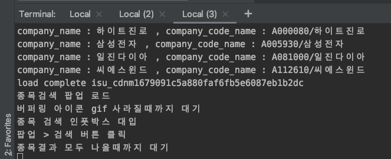
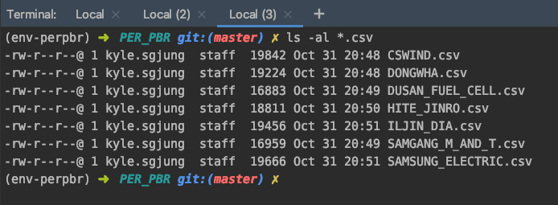

# PER, PBR 다운로드 프로젝트
- 원하는 종목들에 대해서 PER,PBR 정보를 csv로 다운로드 
- 모든 KOSPI 종목에 대해서는 추후 따로 개발예정
- velog 에 정리하려 했으나, 웹사이트를 크롤링하는 것은 공공에 공개하기에는 조금 좋지 않은 인식이 있는 관계로 github에만 정리해둠
- 타사 서버를 느리게 만드는 요인이 되기도 하고 그런 등의 요인들 때문에 공개로 포스팅하기엔 쫌 뭐시기 한 이유가 있었다. 
- velog에 정리해두고 싶었으나... (나중에 다시 보기 편하기 때문에...) 그냥 참았다.

# virtualenv 세팅
```
virtualenv env-perpbr  
source env-perpbr/bin/activate
```

# requirements 설치
```
pip install -r requirements.txt
```

# virtualenv 종료시키기
```bash
deactivate
```

# pycharm 에서 virtualenv 환경 세팅
https://psychoria.tistory.com/447

# command line 실행
```bash
source env-perpbr/bin/activate
python PER_PBR_KRX_crawling.py
```

# 출력결과
## 콘솔


## 다운로드 파일



