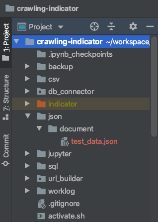

# File 입출력

공공 API에서 코스피 지수를 들고오고 있다. 해당 데이터는 json으로 제공된다. 이 데이터를 ElasticSearch에 Insert 해주어야 한다. ElasticSearch에 데이터를 insert 하려다보니, 

- REST API 로 전달받은 JSON 응답 데이터를
- ElasticSearch에서 Bulk Insert(json 파일 활용)

하는 방식을 사용해야 했다. JSON 응답 데이터를 전달받는 것은 python으로 이미 크롤링 로직을 작성한 상태이다.  

이렇게 받은 JSON 응답데이터를 JSON 파일로 저장할 예정이다.


## 예제 설명

응답데이터는 아래와 같이 생겼다.

```json
{'StatisticSearch': {'list_total_count': 2, 'row': [{'UNIT_NAME': '1980.01.04=100 ', 'STAT_NAME': '6.1.1 주식시장(일별)', 'ITEM_CODE1': '0001000', 'STAT_CODE': '064Y001', 'ITEM_CODE2': ' ', 'ITEM_CODE3': ' ', 'ITEM_NAME1': 'KOSPI지수', 'ITEM_NAME2': ' ', 'DATA_VALUE': '2437.53', 'ITEM_NAME3': ' ', 'TIME': '20200813'}, {'UNIT_NAME': '1980.01.04=100 ', 'STAT_NAME': '6.1.1 주식시장(일별)', 'ITEM_CODE1': '0001000', 'STAT_CODE': '064Y001', 'ITEM_CODE2': ' ', 'ITEM_CODE3': ' ', 'ITEM_NAME1': 'KOSPI지수', 'ITEM_NAME2': ' ', 'DATA_VALUE': '2407.49', 'ITEM_NAME3': ' ', 'TIME': '20200814'}]}}
```


형태를 요약해보면 아래와 같다.

```json
{
  'StatisticSearch': {
    'list_total_count': 2,
    'row': [
      {
        'UNIT_NAME': '1980.01.04=100',
        'STAT_NAME': '6.1.1 주식시장(일별)',
        'ITEM_NAME1': 'KOSPI지수',
        'DATA_VALUE': '2407.49'
      },
      ...
    ]
  }
}
```


이 응답 데이터의 row 에 해당하는 데이터 영역을 BULK INSERT용도의 document 파일(json)에 저장할 예정이다.


# 1. 디렉터리 생성 - os 모듈

> bulk 데이터 저장 디렉터리 생성하는 예제를 통해 정리해보자. 보통 디렉터리의 생성은 python의 기본 내장 모듈인 os 모듈을 사용하는 편이다. os 모듈에서는 mkdir, makedirs 등의 유용한 디렉터리 생성 함수를 제공해준다.

파일 I/O 작업시 Write할 용도의 데이터를 저장할 디렉터리가 존재하는지 검사 후에 해당 디렉터리가 없을 경우에는 디렉터리를 생성하는 작업이다. 디렉터리의 생성은 주로 python의 내장 모듈의 os 모듈을 사용하는 편이다. 

## 참고자료

- [python - create directory if path if it doesn't exist for file write](https://gist.github.com/ByoungInKim/03096da17ff645ae1c4caa2268b2ae9f)
- [How to create files and directories in Python](https://www.kite.com/python/answers/how-to-create-files-and-directories-in-python)


## 예제

```python
import os

if __name__ == '__main__':
  directory = 'json/document/'

  if not os.path.exists(directory):
    os.makedirs(directory)
```


# 2. 파일 입출력 

> 파일 입출력시에는 단순히 open 함수를 사용하면 된다. 
>
> 주요하게 살펴볼 내용은 아래와 같다.
>
> - 파일 입출력시 사용되는 모드의 종류
>
> - open(), close()를 사용하는 일반적인 방식
> - with 문을 사용한 open(), close() 구문을 축약한 방식


## 파일 입출력시의 모드 

> 참고자료
>
> - [open() in python does not create a file if it doesn't exist](https://stackoverflow.com/questions/2967194/open-in-python-does-not-create-a-file-if-it-doesnt-exist)

  

- r 
  - 읽기모드
  - 파일을 읽기만 할 때 사용
- w
  - 쓰기모드
  - 파일에 내용을 쓸 때 사용
  - 파일이 없을 때 생성한 후 내용을 쓸 때에는 'w+' 를 사용한다.
- a
  - 추가모드
  - 파일의 마지막에 새로운 내용을 추가시킬 때 사용


## 참고자료

- [04-3 파일 읽고 쓰기 - 점프 투 파이썬](https://wikidocs.net/26#_2)


## open(), close()를 사용하는 일반적인 방식

```python
import os

if __name__ == '__main__':
  # ...
  arr_data = dict_data['StatisticSearch']['row']
  
  directory = 'json/document/'
    if not os.path.exists(directory):
        os.makedirs(directory)
	
    f = open('json/document/test_data.json', 'w+')
    
    for e in arr_data:
        stringified_json = json.dumps(e)
        stringified_json = stringified_json + "\n"
        f.write(stringified_json)

    f.close()
```


### 출력결과

> 파일이 json/document/test_data.json 으로 저장된것을 확인가능한다.
>
> 


## with 문을 사용한 open(), close() 구문을 축약한 방식

> with 구문 설명 적자....;;;


```python
import os

if __name__ == '__main__':
  # ...
  arr_data = dict_data['StatisticSearch']['row']
  
  directory = 'json/document/'
  if not os.path.exists(directory):
    os.makedirs(directory)
    
  with open('json/document/test_data.json', 'w+') as f:
		for e in arr_data:
      stringified_json = json.dumps(e)
      stringified_json = stringified_json + "\n"
      print(stringified_json)
      f.write(stringified_json)

```


### 출력결과

