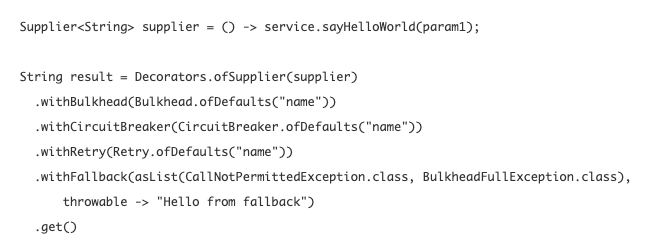

# FeignClient에 Resilience4J CircuitBreaker 연동하기

Resilience4j 에 대한 설명은 https://resilience4j.readme.io/ 에 자세하게 있다. 개인적인 의견을 섞어서 정리해보면 이렇다. Netflix 에서 제공하던 Circuit Breaker 는 유지보수 단계이다. 더 이상 개발하지 않고 유지보수로 하겠다고 했다고 한다.  

Netflix 라이브러리를 이미 사용하고 있는 사람이라면 Netflix 계열의 Circuit Breaker 라이브러리를 사용하는 것도 나쁘지 않을 것 같기는 하다. Netflix 가 어느정도 규모가 있는 회사이기 때문에 라이브러리 유지보수가 종료될 일도 없을 것 같고, 더 이상 개발할 만한 다른 내용이 없을 정도로 안정화되어서 개발을 하지 않는 것 같다는 생각이 들어서이다.   

나는 Resilience4j를 사용하기로 했다. 공식 홈페이지에서 소개하는 Resilience4j 라이브러리를 사용할 경우 예제는 아래와 같다.  



# 참고자료

정리하자 ... ㅠㅜ  

- Feign
  - [https://resilience4j.readme.io/docs/feign](https://resilience4j.readme.io/docs/feign)
- Rate Limiter
  - [https://resilience4j.readme.io/docs/ratelimiter](https://resilience4j.readme.io/docs/ratelimiter)
- Circuit Breaker
  - [https://resilience4j.readme.io/docs/circuitbreaker](https://resilience4j.readme.io/docs/circuitbreaker)

  

# Circuit Breaker 의 개념

## CircuitBreaker 의 핵심개념

정리할 예정이다. 예정이다 😭😭😭  

## RateLimiter 의 핵심개념

정리할 예정이다. 예정이다 😭😭😭  

## Fallback 의 핵심개념

정리할 예정이다. 예정이다 😭😭😭  

​    

## CircuitBreaker, RateLimiter, Feign

Circuit Breaker의 개념을 간단하게 정리해보자. 공식 문서에서는 아래와 같은 그림으로 Circuit Breaker의 역할을 설명하고 있다.  

- [resilience4j.readme.io/docs/feign](https://resilience4j.readme.io/docs/feign)

  

CircuitBreaker 는 제일 앞단에서 특정 API ( 위 예에서는 Feign Client ) 가 차단이 걸린 상태이면 해당 API 를 제공하는 Service 객체로의 접근을 차단한다. CircuitBreaker 가 차단되는 조건은 직접 설정할 수 있는데, 이에 대해서는 아래에서 정리할 예정이다.  

Rate Limiter 는 Circuit Breaker가 특정 API를 차단하지 않은 상태이더라도 특정 Rate를 넘어갈 경우를 대비하는 역할을 한다. 특정 비율을 넘어가면 위의 그림에 있는 MyService 에 대한 접근을 차단하게 된다.  

  

# 라이브러리 선택

직접 Feign 과 같은 역할을 하는 라이브러리를 직접 만들어서 쓸 시간이 있거나 그만한 개발 인력이 투입된다거나, 회사에서 공개 라이브러리를 개발하는 데에 열려있는 마인드라면 라이브러리를 선택하기 위해 굳이 고민할 필요가 없을것 같다. 하지만... 일반적인 경우라면 얼렁얼렁 눈치봐서 오픈소스를 잘 이해하고 잘 사용하는 것이 중요한 경우가 많은듯 하다...  

  

RestTemplate 역시 좋은 라이브러리이다. 안정적인 라이브러리이기 때문이다. 나중에 Rest Template 을 CircuitBreaker에 연동하는 방식 역시 정리할 예정이다.  

  

## Feign 라이브러리

> Feign 라이브러리는 io.github.openfeign 을 선택했다.

Feign Client를 사용할 때 보통 아래의 라이브러리 들중에 하나를 선택한다.

- Netflix Hystrix Feign
- Resilience4j Feign
- Open Feign

나의 경우는 open feign 을 선택했다. 라이브러리의 좋고 나쁨을 떠나서, 첫 번째로 잘 구현한 게 open feign 이어서이다.😏 그래서... Netflix Hystrix Feign , Open Feign 을 구현하는 방식을 정리하는 것은 패스하려고 한다.  

  

## CircuitBreaker 라이브러리

대표적인 Circuit Breaker 라이브러리로는 아래의 4가지가 있다.

- Netflix Hystrix
- Resilience4j
- Sentinel
- Spring Retry

위의 네 가지의 Circuit Breaker 라이브러리 들 중에서 Resilience4j를 사용하기로 결정했다.

이 Circuit Breaker 라이브러리를 Feign 또는 Rest Template 라이브러리와 결합해서 특정 API의 상태를 체크하고, Rate를 Limit 할수(RateLimiter) 있고, 실패(Fallback) 처리 역시 할수 있다.  

​    

Resilience4j Circuit Breaker 설정에 관련해서 docs.spring.io 에서 제공하는 공식문서는 아래와 같다.

https://docs.spring.io/spring-cloud-circuitbreaker/docs/1.0.4.RELEASE/reference/html/#specific-circuit-breaker-configuration  

위의 자료를 한번 보기는 했는데 그리 자세하지는 않다는 생각이 들어서 Resilience4j에서 제공하는 도큐먼트를 참고했다. Spring Framework에서 특정 라이브러리에 대한 모든 도큐먼트를 제공하기에는 역시 무리일 듯 하다는 생각도 들었다.  

  

Resilience4j 에서 제공하는 CircuitBreaker 도큐먼트의 URL은 아래와 같다.  

https://resilience4j.readme.io/docs/circuitbreaker  

  

# build.gradle.kts

사용한 라이브러리들은 아래와 같다.

- io.github.resilience4j
  - resilience4j-spring-boot2
  - resilience4j-all
- org.springframework.cloud 내의 starter 계열 라이브러리
  - spring-cloud-starter-openfeign
  - spring-cloud-starter-config

  

**참고)**  

- spring-cloud-starter-circuitbreaker-resilience4j
  - starter 계열의 라이브러리로 조금 편하게 설정해볼까 했다. 스프링 부트 개발팀을 믿었다. 스프링 부트 개발팀은 개발 의존성들의 옵티멀한 설정을 자동설정으로 어느정도는 맞춰서 제공해준다는데에 약간의 맹신도 있었다.
  - 그런데 load balancing 관련 에러가 발생하고, ribbon 등등 혼동을 주는 에러문구들이 발생한다.
  - load balancing을 현재 프로젝트에 추후 적용할 예정이지만, 지금은 아니다. 
  - **현재 예제의 목적은 Circuit Breaker 를 구현하는 것**에 집중했다.


```kotlin
dependencies{
    // -- resilience4j
    // -- 참고) https://resilience4j.readme.io/docs/gradle
    implementation("io.github.resilience4j:resilience4j-spring-boot2:1.6.1")
    implementation("io.github.resilience4j:resilience4j-all:1.6.1")
    implementation("io.github.resilience4j:resilience4j-feign:1.6.1")
    // 아래 내용들은 resilience4j-all 의존성으로 모두 처리 (circuitbreaker, retry, ratelimiter)
//    implementation("io.github.resilience4j:resilience4j-circuitbreaker:1.6.1")
//    implementation("io.github.resilience4j:resilience4j-retry:1.6.1")
//    implementation("io.github.resilience4j:resilience4j-ratelimiter:1.6.1")

    // -- starter 에서 버전을 맞춰주거나 권장 자동설정으로 유도하는 feign 설정
    implementation("org.springframework.cloud:spring-cloud-starter-openfeign:2.2.5.RELEASE")

    // -- starter 에서 버전을 맞춰주거나 권장 자동설정으로 유도하는 spring-cloud 관련 설정
    implementation("org.springframework.cloud:spring-cloud-starter-config:2.2.5.RELEASE")

    // -- 직접 해보니... 아래 설정은 개발자가 직접 맞춰서 하는 것이 더 편하다.
    // load balancing 관련 에러가 발생하고, ribbon 등등 혼동을 주는 에러문구들이 발생한다.
    // spring-cloud-starter가 현재 프로젝트가 기본으로 netflix Feign 을 사용하는 것으로 오해를 하기 때문인것 같다.
//    implementation("org.springframework.cloud:spring-cloud-starter-circuitbreaker-resilience4j:1.0.4.RELEASE")

}
```


# 스프링 설정

kotlin 을 공부하는 중이고, 현재 프로젝트에는 무조건 kotlin 을 사용하도록 강제했다.  

## CircuitBreaker 인스턴스 생성

더 자세한 API 의 명세는 [resilience4j.readme.io/docs/circuitbreaker](https://resilience4j.readme.io/docs/circuitbreaker) 를 참고하자.  

```kotlin
@Configuration
class NaverNewsSearchCircuitConfig (
        @Value("\${conn.naver.news.baseUrl}")
        private val baseUrl : String
){
  
  // ... 
  
      fun circuitBreakerConfig() : CircuitBreakerConfig {
        val circuitBreakerConfig : CircuitBreakerConfig = CircuitBreakerConfig.custom()
                .failureRateThreshold(50f)
                .slowCallRateThreshold(50f)
                .waitDurationInOpenState(Duration.ofMillis(1000))
                .slowCallDurationThreshold(Duration.ofSeconds(2))
                .permittedNumberOfCallsInHalfOpenState(3)
                .build()

        return circuitBreakerConfig
    }
  
  //...
  
}
```


## RateLimiter 인스턴스 생성

더 자세한 API의 명세는 [resilience4j.readme.io/docs/ratelimiter](https://resilience4j.readme.io/docs/ratelimiter) 를 참고하자.

```kotlin
@Configuration
class NaverNewsSearchCircuitConfig (
        @Value("\${conn.naver.news.baseUrl}")
        private val baseUrl : String
){

  // ...

    // 3) RateLimiter
    // 참고자료 : https://resilience4j.readme.io/docs/ratelimiter
    fun naverNewsSearchRateLimiter(): RateLimiter {

        // ofDefaults를 사용하지 않고 커스텀 설정을 할 경우에 대한 예.
        val rateLimiterConfig: RateLimiterConfig = RateLimiterConfig.custom()
                .limitRefreshPeriod(Duration.ofMillis(1L))
                .limitForPeriod(10)
                .timeoutDuration(Duration.ofMillis(25L))
                .build()

        val rateLimiter: RateLimiter = RateLimiterRegistry.of(rateLimiterConfig)
                .rateLimiter("naverNewsSearchRateLimiter", rateLimiterConfig)

        return rateLimiter
    }
  
  // ...
  
}
```


## NaverNewsSearchCircuitBreaker 인스턴스 생성

위의 CircuitBreaker 인스턴스 생성, RateLimiter 인스턴스 생성 로직들을 결합하고 Feign 라이브러리를 Resilience4J 구현체에 결합해서 CirucuitBreatker, RateLimiter 들이 적용된 Feign Client 인스턴스를 생성하는 과정이다. (Resilience4j 라이브러리 내부 구현을 살펴보니 실제로는 reflection 을 사용하는 것 같았다. .target(...)메서드를 자세히 보자. )  

```kotlin
@Configuration
class NaverNewsSearchCircuitConfig (
        @Value("\${conn.naver.news.baseUrl}")
        private val baseUrl : String
){

  // ...
  
    @Bean
//    fun naverNewsSearchCircuitBreaker(): CircuitBreaker {
    fun naverNewsSearchCircuitBreaker(): NaverNewsSearchClient {
        // 1) 커스텀 circuit breaker 설정
        // 참고) 커스텀 circuit breaker 를 설정하는 방식은 아래 링크에 자세히 설명되어 있다.
        // https://resilience4j.readme.io/docs/circuitbreaker
        val circuitBreakerConfig : CircuitBreakerConfig = circuitBreakerConfig()

        // 2) CircuitBreaker 인스턴스 생성 - CircuitBreakerRegistry를 이용한다.
        val naverNewsCircuitBreaker: CircuitBreaker = CircuitBreakerRegistry
                .of(circuitBreakerConfig)
                .circuitBreaker("naverNewsSearch", circuitBreakerConfig)

        // 단순 CircuitBreaker만 리턴할 것이라면 아래와 같이 return naverNewsCircuitBreaker 를 해주자.
        // return naverNewsCircuitBreaker

        // 3) RateLimiter
        // RateLimiter 의 default 설정
        // val rateLimiter: RateLimiter = RateLimiter.ofDefaults("naverNewsSearch")

        // RateLimiter 커스텀 설정
        // 참고) https://resilience4j.readme.io/docs/ratelimiter
        val naverNewsRateLimiter: RateLimiter = naverNewsSearchRateLimiter()

        // 4) FeignDecorators 객체 생성
        // FeignDecorators 는 circuitBreaker, rateLimiter와 함께 설정한다.

        // 참고)
        // FeignDecorators 는 io.github.openfeign 을 추가한다고 해서 사용가능하지 않다.
        // resilience4j 에서 배포하는 라이브러리이기 때분에 io.github.resilience4j 에서 제공하는
        // resilience4j-feign:1.6.1 을 사용해야 한다.
        val feignDecorators: FeignDecorators = FeignDecorators.builder()
                .withCircuitBreaker(naverNewsCircuitBreaker)
                .withRateLimiter(naverNewsRateLimiter)
                .build()


        // 5) Fallback 설정
        // https://resilience4j.readme.io/docs/feign#fallback
        // 구체적으로 필요한 다른 인자들을 모두 지정해주어야하는데, 코틀린의 특성상 null 체크에 대해 민감하다.
        // 구체적인 코드를 작성하는데에 시간이 조금 걸려서 Fallback 을 구현하는 코드는 CircuitBreaker 관련 설정을 정리하고 나서 제일 나중에 구현해보고 난 후에 정리하려고 한다.
//        val fallback : NaverNewsSearchClientFallback = NaverNewsSearchClientFallback(
//                FeignException.FeignClientException(-1, "Error", Request.create(Request.HttpMethod.GET, "", mapOf("")))
//        )


        // 6) Feign 클라이언트에 Resilience4j Circuit Breaker 적용
        // https://resilience4j.readme.io/docs/feign#fallback
        val client : NaverNewsSearchClient = Resilience4jFeign
                .builder(feignDecorators)
                .target(NaverNewsSearchClient::class.java, "http://naver.com")

        return client
    }
  
  // ...

}
```


## NaverNewsSearchCircuitConfig 전체 코드

NaverNewsSearchCircuitConfig.kt의 전체 코드는 [여기 - lognomy github](https://github.com/soongujung/lognomy/blob/develop/src/main/kotlin/io/chart/lognomy/config/circuitbreaker/newsapi/NaverNewsSearchCircuitConfig.kt)에서 확인할 수 있다.

```kotlin
package io.chart.lognomy.config.circuitbreaker.newsapi

import feign.Feign
import feign.FeignException
import feign.Logger
import feign.Request
import feign.jackson.JacksonDecoder
import feign.jackson.JacksonEncoder
import feign.slf4j.Slf4jLogger
import io.chart.lognomy.newsapi.naver.NaverNewsItemDto
import io.chart.lognomy.newsapi.naver.NaverNewsListDto
import io.chart.lognomy.newsapi.naver.NaverNewsSearchClient
import io.github.resilience4j.circuitbreaker.CircuitBreaker
import io.github.resilience4j.circuitbreaker.CircuitBreakerConfig
import io.github.resilience4j.circuitbreaker.CircuitBreakerRegistry
import io.github.resilience4j.feign.FeignDecorators
import io.github.resilience4j.feign.Resilience4jFeign
import io.github.resilience4j.ratelimiter.RateLimiter
import io.github.resilience4j.ratelimiter.RateLimiterConfig
import io.github.resilience4j.ratelimiter.RateLimiterRegistry
import org.springframework.beans.factory.annotation.Value
import org.springframework.context.annotation.Bean
import org.springframework.context.annotation.Configuration
import java.lang.Exception
import java.time.Duration

@Configuration
class NaverNewsSearchCircuitConfig (
        @Value("\${conn.naver.news.baseUrl}")
        private val baseUrl : String
){
		// 1) CircuitBreaker 인스턴스 생성 및 CircuitBreaker 설정
    fun circuitBreakerConfig() : CircuitBreakerConfig {
        val circuitBreakerConfig : CircuitBreakerConfig = CircuitBreakerConfig.custom()
                .failureRateThreshold(50f)
                .slowCallRateThreshold(50f)
                .waitDurationInOpenState(Duration.ofMillis(1000))
                .slowCallDurationThreshold(Duration.ofSeconds(2))
                .permittedNumberOfCallsInHalfOpenState(3)
                .build()

        return circuitBreakerConfig
    }

    // 3) RateLimiter
    // 참고자료 : https://resilience4j.readme.io/docs/ratelimiter
    fun naverNewsSearchRateLimiter(): RateLimiter {

        // ofDefaults를 사용하지 않고 커스텀 설정을 할 경우에 대한 예.
        val rateLimiterConfig: RateLimiterConfig = RateLimiterConfig.custom()
                .limitRefreshPeriod(Duration.ofMillis(1L))
                .limitForPeriod(10)
                .timeoutDuration(Duration.ofMillis(25L))
                .build()

        val rateLimiter: RateLimiter = RateLimiterRegistry.of(rateLimiterConfig)
                .rateLimiter("naverNewsSearchRateLimiter", rateLimiterConfig)

        return rateLimiter
    }

  	// CircuitBreaker 인스턴스 생성, RateLimiter 인스턴스 생성 로직들을 결합하고 
    // Feign 라이브러리를 Resilience4J 구현체에 결합해서 CirucuitBreaker, RateLimiter 들이 적용된 Feign Client 인스턴스를 생성하는 과정이다. 
  	// (Resilience4j 라이브러리 내부 구현을 살펴보니 실제로는 reflection 을 사용하는 것 같았다. .target(...)메서드를 자세히 보자. )  
    @Bean
//    fun naverNewsSearchCircuitBreaker(): CircuitBreaker {
    fun naverNewsSearchCircuitBreaker(): NaverNewsSearchClient {
        // 1) 커스텀 circuit breaker 설정
        // 참고) 커스텀 circuit breaker 를 설정하는 방식은 아래 링크에 자세히 설명되어 있다.
        // https://resilience4j.readme.io/docs/circuitbreaker
        val circuitBreakerConfig : CircuitBreakerConfig = circuitBreakerConfig()

        // 2) CircuitBreaker 인스턴스 생성 - CircuitBreakerRegistry를 이용한다.
        val naverNewsCircuitBreaker: CircuitBreaker = CircuitBreakerRegistry
                .of(circuitBreakerConfig)
                .circuitBreaker("naverNewsSearch", circuitBreakerConfig)

        // 3) RateLimiter
        // RateLimiter 의 default 설정
        // val rateLimiter: RateLimiter = RateLimiter.ofDefaults("naverNewsSearch")

        // RateLimiter 커스텀 설정
        // 참고) https://resilience4j.readme.io/docs/ratelimiter
        val naverNewsRateLimiter: RateLimiter = naverNewsSearchRateLimiter()

        // 4) FeignDecorators 객체 생성
        // FeignDecorators 는 circuitBreaker, rateLimiter와 함께 설정한다.

        // 참고)
        // FeignDecorators 는 io.github.openfeign 을 추가한다고 해서 사용가능하지 않다.
        // resilience4j 에서 배포하는 라이브러리이기 때분에 io.github.resilience4j 에서 제공하는
        // resilience4j-feign:1.6.1 을 사용해야 한다.
        val feignDecorators: FeignDecorators = FeignDecorators.builder()
                .withCircuitBreaker(naverNewsCircuitBreaker)
                .withRateLimiter(naverNewsRateLimiter)
                .build()


        // 5) Fallback 설정
        // https://resilience4j.readme.io/docs/feign#fallback
        // 구체적으로 필요한 다른 인자들을 모두 지정해주어야하는데, 코틀린의 특성상 null 체크에 대해 민감하다.
        // 구체적인 코드를 작성하는데에 시간이 조금 걸려서 Fallback 을 구현하는 코드는 CircuitBreaker 관련 설정을 정리하고 나서 제일 나중에 구현해보고 난 후에 정리하려고 한다.
//        val fallback : NaverNewsSearchClientFallback = NaverNewsSearchClientFallback(
//                FeignException.FeignClientException(-1, "Error", Request.create(Request.HttpMethod.GET, "", mapOf("")))
//        )


        // 6) Feign 클라이언트에 Resilience4j Circuit Breaker 적용
        // https://resilience4j.readme.io/docs/feign#fallback
        val client : NaverNewsSearchClient = Resilience4jFeign
                .builder(feignDecorators)
                .target(NaverNewsSearchClient::class.java, "http://naver.com")

        return client
    }
}

```

  

# 내일 더 정리해야 하는 내용들

- RateLimiter 의 개념, 컨셉, 동작
- Circuit Breaker 의 개념, 컨셉, 동작
- Fallback 의 개념, 컨셉, 동작. 
  - (이것 까지 정리할 수 있을지는 모르겠다. 다음 문서에서 전담해서 정리하는게 나을 것 같다는 생각이다.)  

  

# 마치면서

스프링부트에서 CircuitBreaker와 OpenFeign을 연동하는 것이 쉽지 않았었다. 소스 코드 코딩보다 의존성 설정에서 어떤게 어떤거랑 관련있는지도 모르고 크게 어려움을 겪었었다. 직접 자료를 찾아보니 의존성 설정은 스프링 공식문서를 참고하고, Feign, CircuitBreaker 설정 코드는 resilience4j 의 자료를 참고하면 되었었던것 같다.


