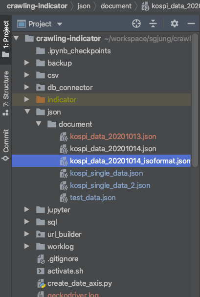
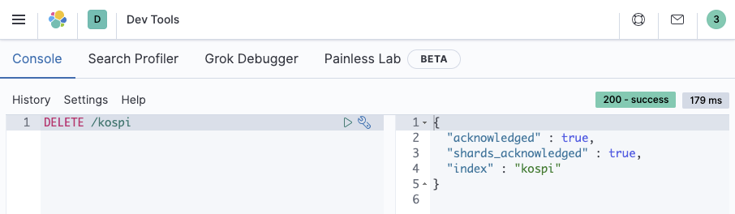
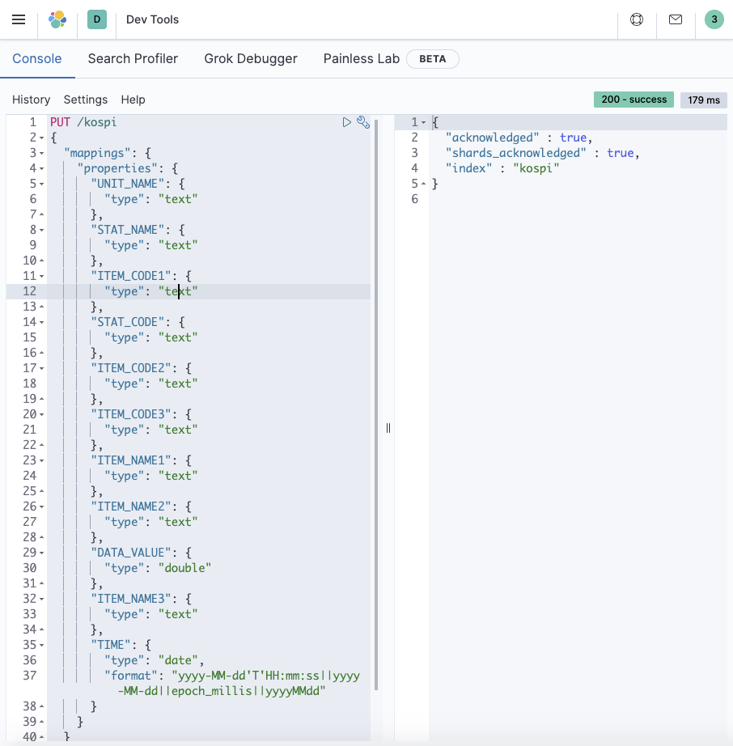

# KOSPI 데이터 인덱스 Create/Insert/Mapping (ELK Cloud)

>  [velog 문서](https://velog.io/@gosgjung/chartnomy-KOSPI-%EA%B2%BD%EC%A0%9C%EC%A7%80%ED%91%9C-InsertMapping-ELK-Cloud) 에 게시한 글. git을 통해 버전관리중!!

  

# KOSPI 데이터 json 파일 생성
이번 글에서는 Elastic Cloud 개설 초기 단계에 KOSPI 지표 관련 벌크 데이터를 INSERT 해보고 실제로 잘 동작하는지를 테스트하는 과정을 다룬다. Spring Boot 의 Data Source 로 Elastic Cloud를 연동하는 과정은 다음글에서부터 본격적으로 다루기 시작한다. 

  

[한국은행 경제 통계 시스템](http://ecos.bok.or.kr/) 에서 REST API 로 KOSPI 데이터를 제공해준다. 그래서 이번 예제에서는 [한국은행 경제 통계시스템 API](http://ecos.bok.or.kr/)를 적극적으로 활용했다. 사용한 언어는 python 이다. 프로젝트 초반에 아무것도 되어있지 않은 상태에서 빠르게 공수를 조달할 수 있는 언어는 역시 python 만한게 없는 것 같다.👍  

  

작업 과정을 정리해보면 아래와 같이 크게 네 단계의 작업으로 진행했다.

- REST 데이터를 가져와서 json 파일로 저장하는 작업
  - python 의 urllib3와 기타 여러가지 타입지정 등등의 연산을 섞어서 사용했다.
  - 그리 어렵지 않아서 누구든 해볼수 있지 않을까 싶다.
- 인덱스 삭제
  - 인덱스가 이미 존재한다면, 삭제를 해야 한다면 어떻게 해야하는지를 정리해두었다.
  - 계속 만들어보다가 인덱스 싹다 지우고 새로 만들고 싶을때가 많을것 같아서이다.
- 인덱스 생성/매핑
  - 아직 스프링 부트의 데이터소스와 결합해서 테스트해보지 않았다.
  - 데이터가 있어야 스프링부트와 연동하는 데이터소스가 잘 동작하는지 확인가능할 것 같았다.
  - CURL 커맨드를 활용해 초기 테스트 데이터를 INSERT 했다.
  - 인덱스 생성과 동시에 매핑을 하는 방식을 선택했다.
  - 아무래도 기존 데이터들의 타입을 바꾸는 매핑 작업은 오버헤드가 커서인지 최신버전부터는 대부분 Deprecated 된것으로 보인다.
- BULK INSERT
  - CURL 커맨드 (Bulk Insert)


## requirment.txt
현재 시점에서 urllib3의 최신 버전은 1.25.10 이다. 하지만 최신버전이 불안정한 편이다. 따라서 이 예제에서는 1.25.9 버전의 urllib3 라이브러리를 사용한다.  

**vim requirements.txt**

```txt
urllib3==1.25.9
:wq
```

  

## 가상환경 설정

```bash
$ pip install virtualenv
$ virtualenv ecos-crawler
$ source ecos-crawler/bin/activate
$ (ecos-crawler) pip install -r requirements.txt
```

  

## python 코드

코드가 그리 어렵지 않다. 따로 설명을 정리해놓을 필요는 없을 듯 하다.  
```python
import urllib3
import json
import os
import datetime

date_formatter = '%Y%m%d'

COLUMN_LIST = [
        'STAT_NAME',  'STAT_CODE',  'ITEM_CODE1', 'ITEM_CODE2', 'ITEM_CODE3',
        'ITEM_NAME1', 'ITEM_NAME2', 'ITEM_NAME3', 'DATA_VALUE', 'TIME'
    ]

api_key = '--'

def custom_converter(obj):
    if isinstance(obj, datetime.datetime):
        return obj.isoformat().__str__()


if __name__ == '__main__':
    url = "http://ecos.bok.or.kr/api/StatisticSearch/{}/json/kr/1/50000/064Y001/DD/20190101/20201231/0001000" \
        .format(api_key)

    print(" ####### URL #######")
    print(url)

    http = urllib3.PoolManager()
    ret = http.request("GET", url, headers={'Content-Type': 'application/json'})

    str_response = ret.data.decode('utf-8')
    dict_data = json.loads(str_response)

    arr_data = dict_data['StatisticSearch']['row']

    directory = 'json/document/'
    if not os.path.exists(directory):
        os.makedirs(directory)

    with open('json/document/kospi_data_20201014_isoformat.json', 'w+') as f:
        for e in arr_data:
            # type 을 지정할 경우 (7.x 아래 버전)
            # dict_index = {'index': {'_index': 'indicators', '_type': 'kospi', '_id': e['TIME']}}

            # type 을 지정하지 않을 경우 (7.x 부터)
            # datetime 타입으로 변환
            e['TIME'] = datetime.datetime.strptime(e['TIME'], date_formatter)

            # index 표현 용도 딕셔너리에 임시 저장
            dict_index = {'index': {'_index': 'kospi', '_id': e['TIME']}}
            str_index_id = json.dumps(dict_index, default=custom_converter)
            stringified_json = str_index_id + "\n"

            stringified_json = stringified_json + json.dumps(e, default=custom_converter)
            stringified_json = stringified_json + "\n"
            print(stringified_json)
            f.write(stringified_json)
```

  

## 실행

```bash
$ source ecos-crawler/bin/activate
$ (ecos-crawler) python json-korbank-kospi.py
```
만들어진 json 파일의 이름은 `kospi_data_20201014_isoformat.json` 이다.


  

# Elastic Cloud - 인덱스 관리(생성/삭제/데이터 insert)

Elastic Cloud에 초기 데이터를 INSERT 할 예정이다. Spring Data Elasticsearch 를 통해 Bulk Insert를 수행하지 않은 상태를 가정해서 초기 데이터를 세팅하는 과정을 다뤄보려 한다. (이글을 처음 쓸때에는 Spring Data Elasticsearch를 세팅하지 않은 시점이었다. Spring Data ElasticSearch 를 잘 활용하면 Bulk Insert가 가능하다.)  

  

## 인덱스 삭제
만약 인덱스를 잘못 생성해서 삭제해야 하는 경우가 있다. 인덱스를 삭제하는 명령어는 아래와 같다.
```bash
$ DELETE /kospi
```


  

## 인덱스 생성/매핑

> 인덱스 생성과 동시에 매핑을 적용하는 방식을 선택했다. 추후 스키마의 타입등을 바꾸는 것에 대한 것은 따로 찾아봐야 할 듯하다. 

인덱스를 매핑하는 작업은 관계형 DB를 기준으로 생각해보면 테이블을 CREATE하고, 타입을 수정해야 하는 경우 ALTER 명령을 내리는 과정과 유사한 과정이다.  

인덱스는 MySQL과 비교했을때 Schema와 유사한 개념이라고 생각하면 된다. 테이블에 대응되는 개념은 6.x 대의 ElasticSearch 까지는 Type 이라는 개념이 있었다. 하지만 ElasticSearch 7.x 부터는 Type 개념은 Deprecated 되었다. 즉, 7.x 부터는 MySQL의 Schema와 비슷한 개념인 Index 하나로 필요한 데이터들을 제각각으로 관리하는 것만 가능하다. (인덱스 내에 여러개의 타입을 두어 중첩구조로 관리하는 것은 Elastic Search 6.x까지만 가능하다.)  

인덱스를 생성하는 방법은 여러가지 방법이 있는데, 여기서는 인덱스 생성과 동시에 매핑을 적용하는 예제로 정리해본다.  

  

### 참고자료
- [인덱스 생성과 동시에 매핑 적용](https://www.elastic.co/guide/en/elasticsearch/reference/current/mapping.html#_explicit_mappings)
  - You can use the [create index](https://www.elastic.co/guide/en/elasticsearch/reference/current/indices-create-index.html) API to create a new index with an explicit mapping.
- [Elastic Search의 Data Type 들](https://www.elastic.co/guide/en/elasticsearch/reference/current/sql-data-types.html)
- [Date 타입 매핑시 Date Format 관련 자료](https://www.elastic.co/guide/en/elasticsearch/reference/current/mapping-date-format.html)  
  - date 형식 데이터를 매핑할 때 mappings.properties.date.format 에 지정해줄수 있는 다양한 형식들을 정리해주고 있다.
  
- [Date field Type](https://www.elastic.co/guide/en/elasticsearch/reference/current/date.html)
  - 사용할 수 있는 날짜 서식형식을 정리하고 있다.
  - 날짜의 서식을 yyyy-MM-dd HH:mm:ss 인 데이터도 받아들이고 yyyy-MM-dd 형태의 데이터도 받아들이려 하는 경우에 사용한다.

참고) [Elastic Cloud 공식 레퍼런스 예제 스크린샷](https://www.elastic.co/guide/en/elasticsearch/reference/current/date.html)
  

  

### CURL 커맨드 (인덱스 생성&매핑)

위의 참고자료들을 참고하면서 매핑을 적용한 예제의 스크린샷은 아래에 남겨두었다. 가운데에 'T'가 들어간 날짜 형식을 ISO 포맷이라고 부른다. 인덱스 생성 & 매핑시 주요하게 고려한 데이터 타입은 날짜 형식이었다. Spring Data JPA ElasticSearch에서 인식하는 날짜 포맷은 Elastic Search 가 받아들일 수 있는 날짜 형식에 비해 한정적이다. 아래는 Elastic Search가 허용하는 날짜 포맷과 Spring Data JPA ElasticSearch에서 허용하는 날짜 포맷의 차이점이다.  

- Elastic Cloud 
  - 'T'가 들어가지 않고도 Elastic Cloud에 매핑과 Bulk Insert 모두 가능하다.
  - 즉, ISO 포맷을 고집하지 않아도 Elastic Cloud에 데이터 insert가 가능하다.
- Spring Data JPA Elastic Search
  - 시/분/초 이상의 단위를 사용해 Spring Data JPA Elastic Search 에서 데이터를 insert할 때 Spring Data JPA Elasticsearch 에서는 ISO 포맷만을 지원하는 것으로 보인다.
  - 참고자료 : [mapping data format](https://www.elastic.co/guide/en/elasticsearch/reference/current/mapping-date-format.html)
  

  



실제로 사용한 명령어는 아래와 같다.
```bash
PUT /kospi
{
    "mappings": {
        "properties": {
            "UNIT_NAME": {
                "type": "text"
            },
            "STAT_NAME": {
                "type": "text"
            },
            "ITEM_CODE1": {
                "type": "text"
            },
            "STAT_CODE": {
                "type": "text"
            },
            "ITEM_CODE2": {
                "type": "text"
            },
            "ITEM_CODE3": {
                "type": "text"
            },
            "ITEM_NAME1": {
                "type": "text"
            },
            "ITEM_NAME2": {
                "type": "text"
            },
            "DATA_VALUE": {
                "type": "double"
            },
            "ITEM_NAME3": {
                "type": "text"
            },
            "TIME": {
                "type": "date",
                "format": "yyyy-MM-dd'T'HH:mm:ss||yyyy-MM-dd||epoch_millis||yyyyMMdd"
            }
        }
    }
}
```

  

## Bulk Insert

위에서 정리한 파이썬 코드로 생성한 json 파일인 `kospi_data_20201014_isoformat.json` 을 활용해서 Elastic Cloud 에 데이터 insert 명령을 보내보자. 처음 Elastic Cloud 를 개설했을 때 데이터를 insert하는 명령이 자꾸 거부되서 이틀 동안을 컴퓨터에만 앉아서 보냈던 것 같다. 휴일에 놀지도 못하고 이렇게 컴퓨터를 했었더랬다.  

CURL 을 이용한 Bulk Insert 명령어는 아래와 같다.  

  

### CURL 커맨드 (Bulk Insert)
```bash
$ curl -X POST -H 'Content-Type: application/json' \
--user elastic:ZMDnxlVzyQkGQwrYDOh9nkl9 \
https://a2580127b5fa47a783245a38d16c6a76.ap-northeast-2.aws.elastic-cloud.com:9243/kospi/_bulk?pretty \
--data-binary @kospi_data_20201014_isoformat.json
```

사실 Spring Data ElasticSearch, QueryDSL 등을 이용해 BULK INSERT를 수행할 수 있기는 하다. 하지만 초기데이터는 CURL을 이용해 BULK INSERT 했다. 다양한 종류의 예제들을 남겨놓으면 나중에 국끓여먹듯이 사용할 수 있을 것 같다.

INSERT 가 정상적으로 수행된 모습은 아래와 같다.


  

# 마치면서

ElasticCloud에 데이터를 INSERT하는 과정에 대해 두번 정도 글을 썼었는데, 너무 정리가 되지 않았다. 내가 뭔가를 했던 것에 대해서 정리하는 글을 쓰는 작업은 너무 힘든 과정인것 같다. 이런 작업을 정말 쉽게 하는 사람들도 있는 것 같기는 하다.   

다만, 글을 쓰면서 조금씩 내가 성숙해지는 것 같다는 생각이다. 조금씩 철이 들고 어른스러워지는 것 같다는 생각이다. 벨로그에 일단 정리는 해놓았지만 관리가 안되서 스트레스도 받고 했지만, 필요없는 내용들을 과감하게 쳐내면서 깔끔하게 정리하면서 조금씩은 위안을 얻었다.  

힘들게 머리 싸매면서 삽질?을 했던 내용들은 정리할 때 감정적인 소모가 들어가서 어렵게 정리되는 것도 하나의 이유가 되지 않을까 싶다.