# ELK Cloud - 경제지표 데이터 Bulk Insert

[velog.io - ELK Cloud - 경제지표 데이터 Bulk Insert](https://velog.io/@gosgjung/chartnomy-ELK-Cloud-%EA%B2%BD%EC%A0%9C%EC%A7%80%ED%91%9C-%EB%8D%B0%EC%9D%B4%ED%84%B0-Bulk-Insert) 에 정리했던 내용을 깃헙에 백업하는 용도로 정리.


> 목요일 ~ 금요일 동안 포스팅을 하려 했으나, Elastic Cloud에 외부(로컬 개발환경)에서 BULK INSERT API를 요청할 때 curl 커맨드의 형식을 맞추는게 번번히 실패해 삽질을 거듭하다가 어제 저녁에 부랴부랴 성공했다.(이렇게 실패한 원인에는 공식문서의 글을 맹신한것도 어느정도 기여했다.)  
>
> 삽질을 하면서... 이번 글의 시리즈 자체를 포기하려고 했다가 다시 글쓰는걸 시작하게 되었다.  
>
> 아래는 이번 글의 목표다.  
> - **Elastic Cloud 내에서 Kibana Console 활용법**
>   - 인덱스 생성, 조회, 삭제 등을 다뤄볼 예정이다.
>   - QueryDsl 기반 조회방식 등 고급 조회는 추후 다른 글에서 정리할 예정이다.
>     - 자바 쪽 QueryDsl 말고, Elastic에 Query를 날릴때 DSL을 사용하는 경우가 있다. 이 경우에 대해 추후 정리 예정이다.
> - **[한국은행 경제 통계 시스템](http://ecos.bok.or.kr/)에서 제공하는 API를 활용한 python으로 데이터 크롤링 + json 형식으로 저장**
>   - 코틀린으로 할수도 있고, java 로 할수도 있다. 하지만 아직 뭔가가 결정되지 않은 상태에서 굳이~ 그렇게 크게 공수를? 하는 생각이 들었다.
>   - java 밖에 할 줄 모르는 고인물이라면, java 하앍하앍~ 이러면서 달려들겠지만, python,node.js로도 충분히 할수 있는 유틸리티성 작업이다.
>   - 추후 Kotlin + Spring Batch 기반 프로젝트로 고도화 예정이다.
> - **Elastic Cloud 에 Bulk Insert로 데이터 INSERT**
>   - 아직은 로컬 PC에서 Bulk Insert하고 있다.
>   - 추후 Elastic Cloud 에서 제공하는 logstash를 활용해 실시간으로 데이터 업데이트를 수행하는 방법 역시 시도해볼 예정이다.
>   - 이 과정에서 참고한 좋은 자료는 역시 [김종민님 의 youtube 영상](https://www.youtube.com/watch?v=_kF0cLGpu7w)이었다. 조금 길지만 참고 들었다.

한국 Elastic Cloud 에 경제지표 데이터를 INSERT 해보려 한다.  

  

# 인덱스 생성

kibana console을 활용해 인덱스를 생성해봅시다.  

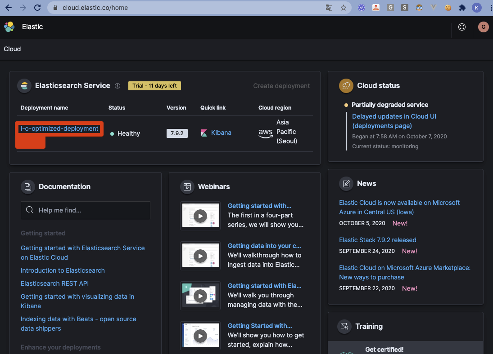

  

Kibana 메뉴 옆의 Launch 버튼을 클릭  
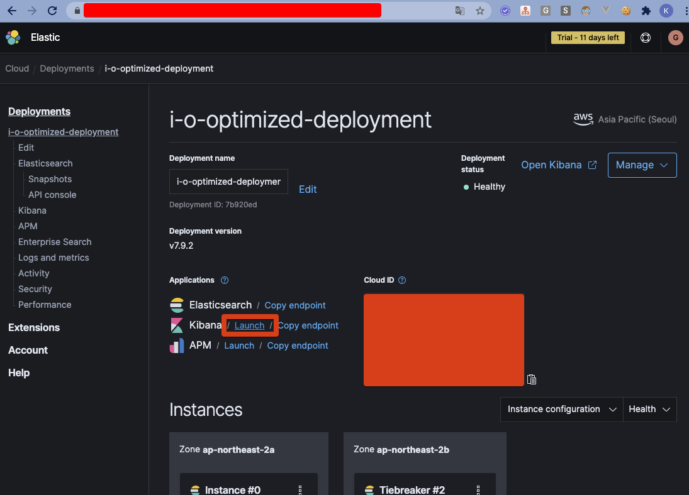

  

Kibana > Management > Dev Tools 클릭
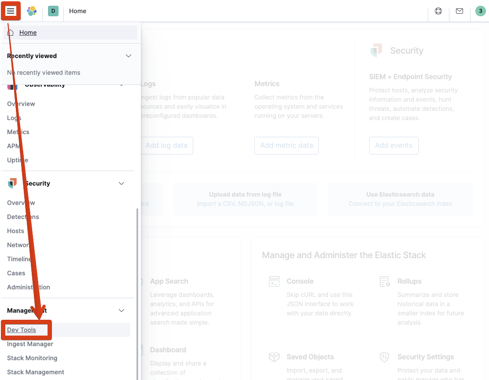

  

**index 생성**  

> PUT [인덱스명]
> ndex는 관계형 데이터베이스로 치면 MySQL의 스키마와 같은 개념이다. 보통 스키마 밑에 테이블들이 여러 개 있다. 테이블의 개념은 6.x 까지는 타입(type)이었는데, 7.x 대에서 이 개념이 DEPRECATED 되었다.

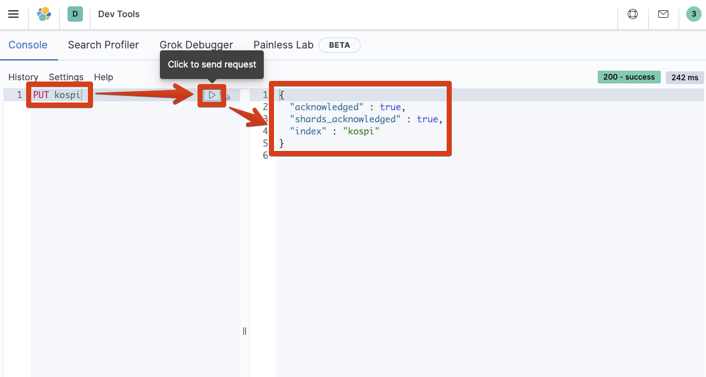

  

**index 삭제**  

> DELETE [인덱스명]

index를 삭제하려면 아래와 같이하면 된다. 이 역시 키바나 콘솔에서 수행했다. (추후 Spring Boot 에서 DataSource를 연결하게 되면 SpringBoot로 CRUD API를 작성했던 내용 역시 정리할 예정이다.)  
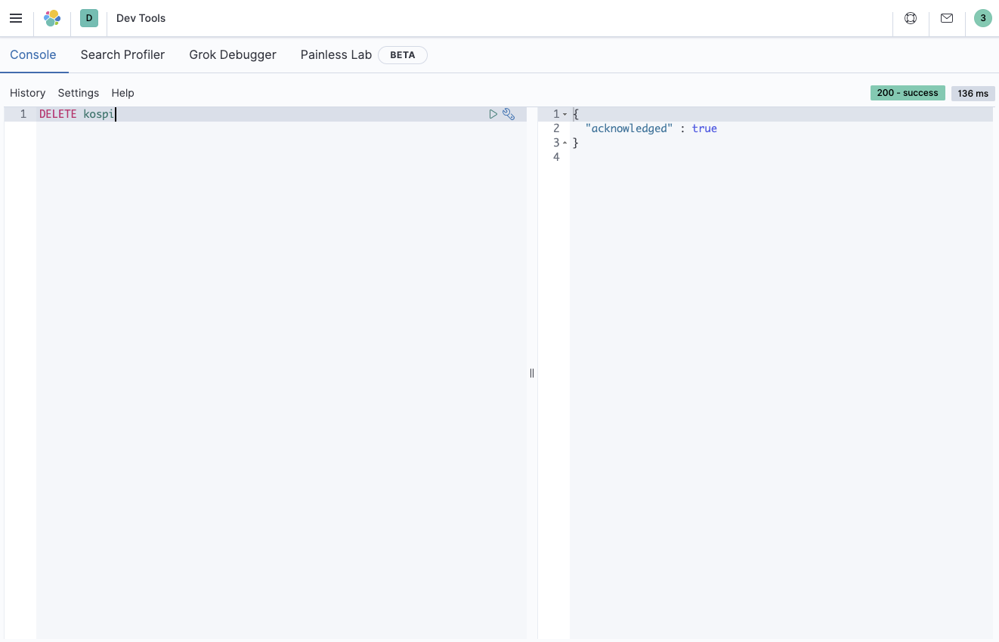

  

**명령어 도움말 documentation 확인하기**  
렌치 버튼 클릭 -> Open documentation 클릭  
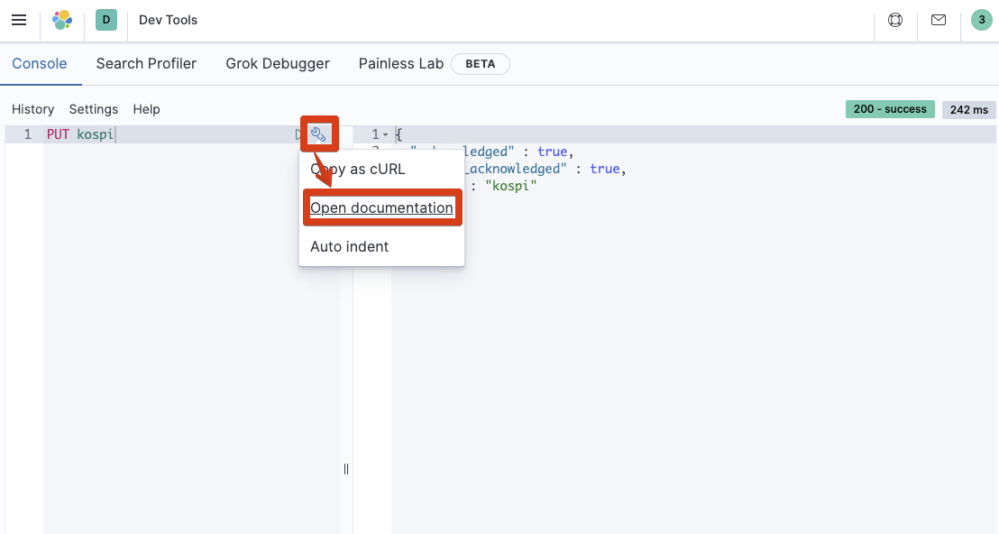

  

[도큐먼트 페이지](https://www.elastic.co/guide/en/elasticsearch/reference/7.9/indices-create-index.html)를 확인할 수 있다.
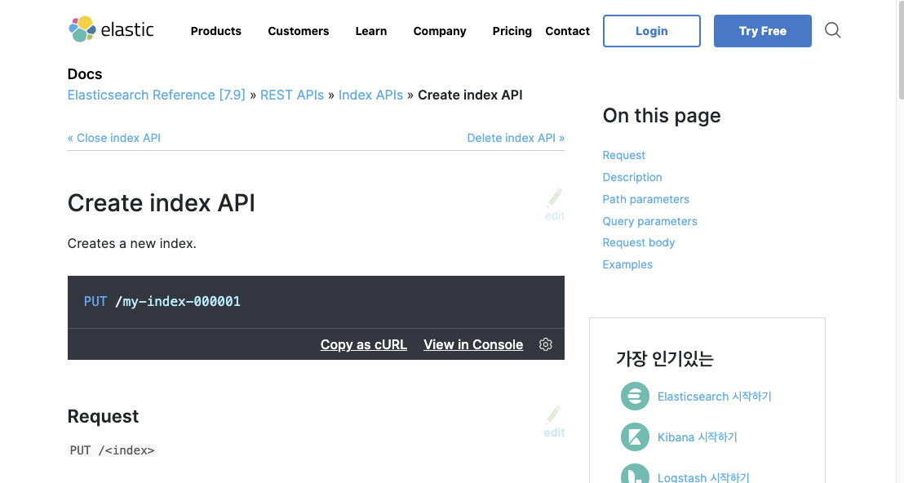

  

# 한국은행 통계 API 크롤링

[한국은행 경제 통계 시스템](http://ecos.bok.or.kr/)에서 제공하는 API를 활용한 python으로 데이터 크롤링 + json 형식으로 저장하는 작업들을 정리해볼 예정이다.  

phantomjs 등과 같은 고스트 브라우저를 이용해 크롤링하는 것이 아닌 API를 이용한 크롤링이기 때문에 충분히 Java를 이용해 수행하는 것 역시 가능하다.  

  

그런데 python/node.js 등을 사용할 줄 아시는 분이라면 그런데... 굳이... 자바로? 이렇게 이야기하실수 있다. 맞는 이야기이다. 여기서는 파이썬으로 초기 데이터를 크롤링할 예정이다.  

추후 kotlin 기반 Spring Batch로 API 크롤링하는 작업을 세분화할 예정이다.  

  

## 한국은행 가입 및 API Key 발급

추후 정리 예정... 그렇게 어렵지 않으나 스샷 등의 작업이 너무 ㅁㄴ항ㅁ많다..  

  

## urllib3 의존성 및 가상환경 설정

현재 시점에서 urllib3의 최신 버전은 1.25.10 이다. 하지만 최신버전이 불안정한 편이다. 따라서 이 예제에서는 1.25.9 버전의 urllib3 라이브러리를 사용한다.  

  

### requirements.txt

vim requriements.txt

```txt
urllib3==1.25.9
:wq
```

  

### 가상환경 설정

```bash
$ pip install virtualenv
$ virtualenv ecos-crawler
$ source ecos-crawler/bin/activate
$ (ecos-crawler) pip install -r requirements.txt
```

  

## python 코드

코드에 대한 설명을 적을까 고민을 했었다. 그런데, 곰곰히 생각해보니 아래 코드가 그리 어려운 코드는 아니다. 설명을 적더라도 국어책 받아쓰기하는 느낌이 들것 같다는 생각이 들었다.  

  

python 언어를 접해본 누구든 이해할 수 있을 것 같다. 그래서 과감하게 설명을 생략하고 코드 전문만 남겨본다.

```python
import urllib3
import json
import os

COLUMN_LIST = [
        'STAT_NAME',  'STAT_CODE',  'ITEM_CODE1', 'ITEM_CODE2', 'ITEM_CODE3',
        'ITEM_NAME1', 'ITEM_NAME2', 'ITEM_NAME3', 'DATA_VALUE', 'TIME'
    ]

api_key = '-- 직접 발급받으세요 --'

if __name__ == '__main__':
    url = "http://ecos.bok.or.kr/api/StatisticSearch/{}/json/kr/1/50000/064Y001/DD/20190101/20201231/0001000" \
        .format(api_key)

    print(" ####### URL #######")
    print(url)

    http = urllib3.PoolManager()
    ret = http.request("GET", url, headers={'Content-Type': 'application/json'})

    str_response = ret.data.decode('utf-8')
    dict_data = json.loads(str_response)

    arr_data = dict_data['StatisticSearch']['row']

    directory = 'json/document/'
    if not os.path.exists(directory):
        os.makedirs(directory)

    # index, id 추가 안할 때의 데이터
    # with open('json/document/kospi_data.json', 'w+') as f:
    #     for e in arr_data:
    #         stringified_json = json.dumps(e)
    #         stringified_json = stringified_json + "\n"
    #         print(stringified_json)
    #         f.write(stringified_json)

    # index, id 추가 한 후의 데이터
    # type 역시 추가
    with open('json/document/kospi_data.json', 'w+') as f:
        for e in arr_data:
            # type 을 지정할 경우
            # dict_index = {'index': {'_index': 'indicators', '_type': 'kospi', '_id': e['TIME']}}
            # type 을 지정하지 않을 경우
            dict_index = {'index': {'_index': 'kospi', '_id': e['TIME']}}
            str_index_id = json.dumps(dict_index)
            stringified_json = str_index_id + "\n"

            stringified_json = stringified_json + json.dumps(e)
            stringified_json = stringified_json + "\n"
            print(stringified_json)
            f.write(stringified_json)
```

  

## 실행

실행하는 법은 아래와 같다. 굳이 TMI스럽게 설명까지 적을 필요까진 없겠지...

```bash
$ source ecos-crawler/bin/activate
$ (ecos-crawler) python json-korbank-kospi.py
```

  

만들어진 json 파일의 이름은 json/document/kospi_data.json 이다.  

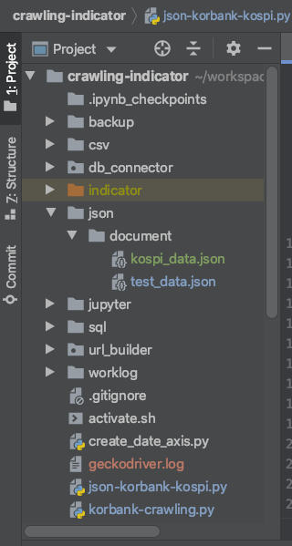

  

# Bulk Insert to Elastic Cloud

> 오늘 이 글에서 밀어넣을 경제지표 데이터는 'kospi'이다. kospi 외에도 한국 가계금리, 기업금리, 미국 기준금리 등의 데이터를 각각 다른 파이썬 파일로 크롤링을 했다.
>
> 한국은행 경제통계 시스템 사이트를 이용하는 방법은 추후 다른 글에서 정리하는 편이 낫겠다는 생각이 든다.

Elastic Cloud 내에 새로 생성된 ElasticSearch 노드에 데이터를 Bulk Insert하는 작업이다. 데이터를 한방에 밀어넣을때는 이렇게 Bulk Insert 를 한다.

경제 지표 관련 초기 데이터가 Elastic Cloud 에 없으므로 insert를 하는 과정이다.  

  

## 단건 데이터 Insert 테스트

데이터를 Bulk Insert 하기 전에 단건의 데이터를 Insert하면서 이게 Insert가 되는 json 형식인지 테스트를 해봐야 한다. (마치 군대에서 영점사격을 하는 것과 같은 과정이다.)  

  

JSON으로 생성된 파일의 첫번째 라인을 복사해서 _BULK 명령어로 수행했다. 결과는 errors: false, result: created 메시지를 보아 정상적으로 잘 생성되었음을 확인 가능하다.  
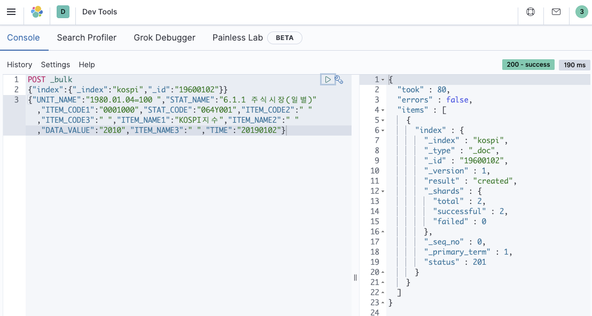

혹시라도 이 명령어를 이용하려는 사람이 있을것 같아 텍스트로 남겨놓는다.

```bash
POST _bulk
{"index":{"_index":"kospi","_id":"19600102"}}
{"UNIT_NAME":"1980.01.04=100 ","STAT_NAME":"6.1.1 주식시장(일별)","ITEM_CODE1":"0001000","STAT_CODE":"064Y001","ITEM_CODE2":" ","ITEM_CODE3":" ","ITEM_NAME1":"KOSPI지수","ITEM_NAME2":" ","DATA_VALUE":"2010","ITEM_NAME3":" ","TIME":"20190102"}
```

  

## Bulk Insert

로컬 개발 PC에서 Elastic Cloud로 curl 커맨드를 통해 Bulk Insert 하는 과정을 정리해려 한다. 공식 다큐먼트 페이지에서 제공하는 자료들은 아래와 같다.  


### 참고자료

공식 document 대로 API Key를 발급받아 -H 옵션에 추가해서 진행해봤으나 실패~  

뭣이 문제인가? 하고 하루 정도를 온전히 투자해서 삽질을 했다. -d 옵션에 API Key를 주어 시도를 했을때 데이터로 인식하기 때문에 실패하더라.  

그냥 아래와 같이 하면 되는 거였더라. 시간이 너무 아깝다. ㅠㅠ  

- --user 옵션을 주고 user:password 값을 넘겨주면 만사 OK 이다.
- 애플리케이션에서 접근하는 API_KEY 방식은 추후 또 정리할 날이 올 듯하다.

#### 공식 document

- [Access the API from Command Line](https://www.elastic.co/guide/en/cloud-enterprise/current/ece-api-command-line.html)
- [Authenticate using an API Key](https://www.elastic.co/guide/en/cloud-enterprise/current/ece-restful-api-authentication.html#ece-api-keys)
- [Authenticate using a bearer token](https://www.elastic.co/guide/en/cloud-enterprise/current/ece-restful-api-authentication.html#ece-restful-api-authentication-token)

### ElastchSearch End Point 복사  

[cloud.elastic.co](https://cloud.elastic.co/) 방문 & 로그인  
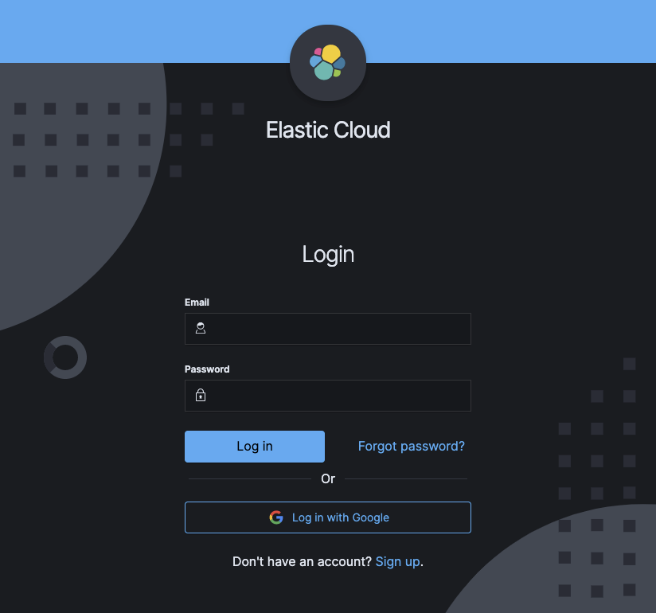

  

Deployment name 에 적힌 node 를 클릭  
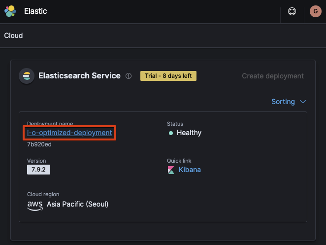

  

Copy endpoint 클릭  
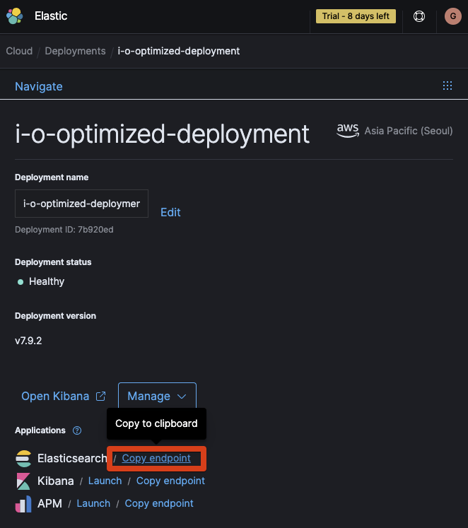

이렇게 복사한 Elasticsearch URL을 메모장이나, 텍스트 파일 어디든 붙여넣고 저장해두고 있다가 Bulk Insert에 붙여넣어 사용하자.

  

### curl command

#### 명령어 형식

```bash
curl -X POST -H 'Content-Type: application/json' \
--user elastic:GsGEHMOXf5adNKNa7qGXKM9J \
https://[ElasticSearch End Point]/[인덱스명]/_bulk?pretty \
--data-binary @[bulk 데이터 파일명 full 경로]
```

  

#### 명령어 예제

**개행(new line)을 적용한 명령어**

```bash
curl -X POST -H 'Content-Type: application/json' \
--user elastic:GsGEHMOXf5adNKNa7qGXKM9J \
https://f765633ef8c84c4a9fb0b0f8f24ad84d.ap-northeast-2.aws.elastic-cloud.com:9243/kospi/_bulk?pretty \
--data-binary @test_data.json
```

  

**개행 없이 적용한 명령어**
Atom 에디터에 실패한 명령어들을 저장해두고 수정해가면서 개행 문자없이 명령어를 날렸었다. 개행문자가 개입되면 어디서 잘못됬는지 파악이 어렵기 때문이다.

```bash
curl -X POST -H 'Content-Type: application/json' --user elastic:GsGEHMOXf5adNKNa7qGXKM9J https://f765633ef8c84c4a9fb0b0f8f24ad84d.ap-northeast-2.aws.elastic-cloud.com:9243/kospi/_bulk\?pretty --data-binary @test_data.json
```