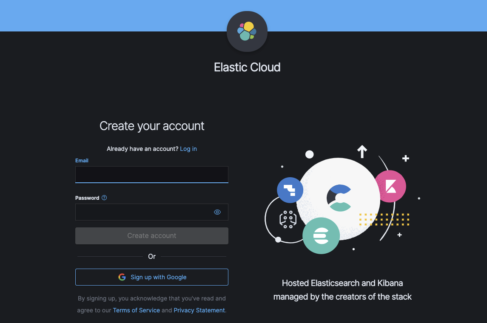
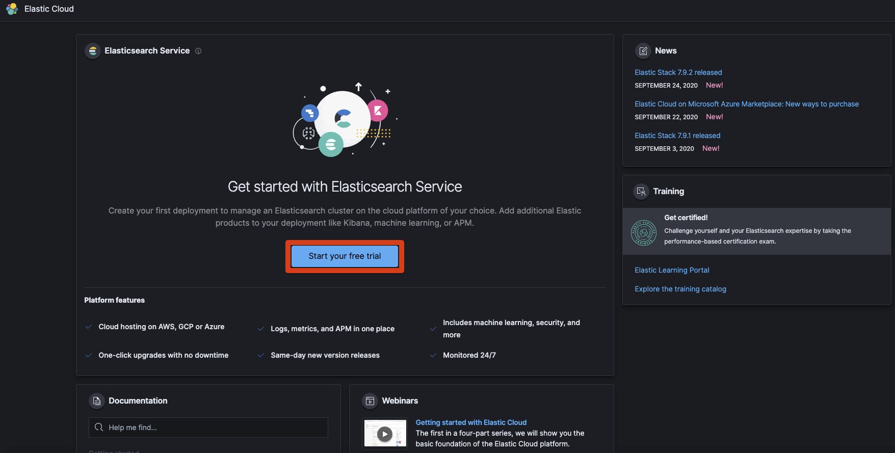
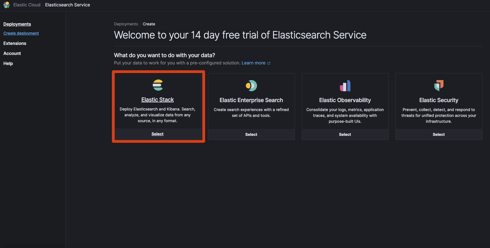
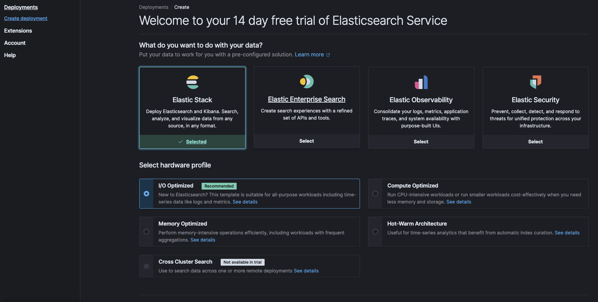
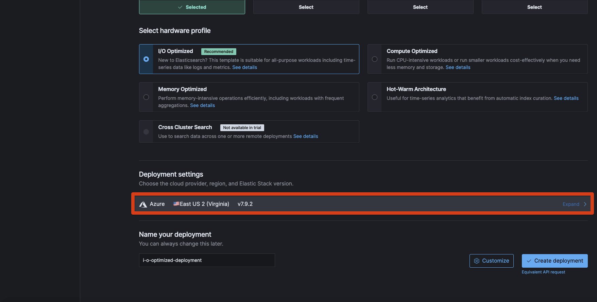
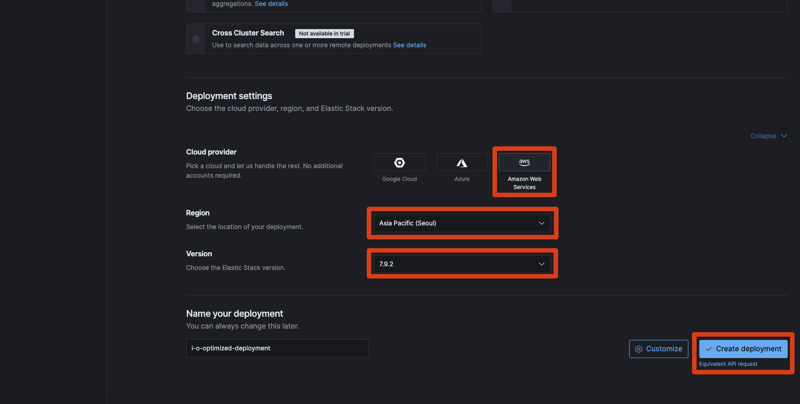
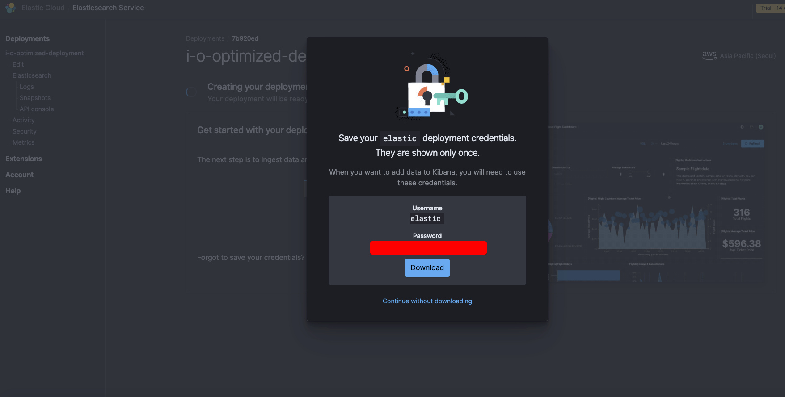
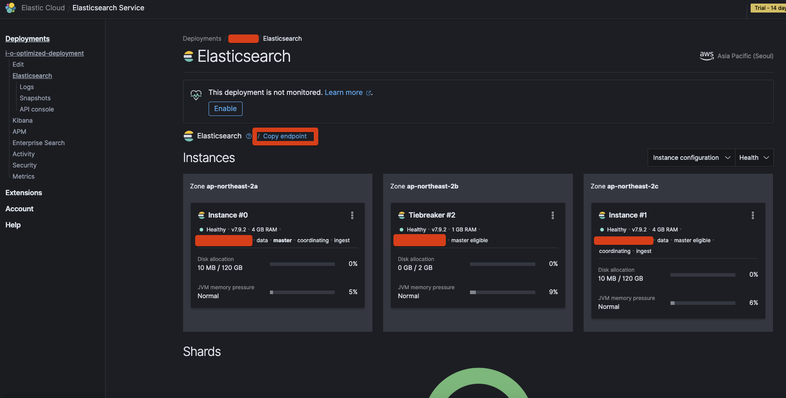
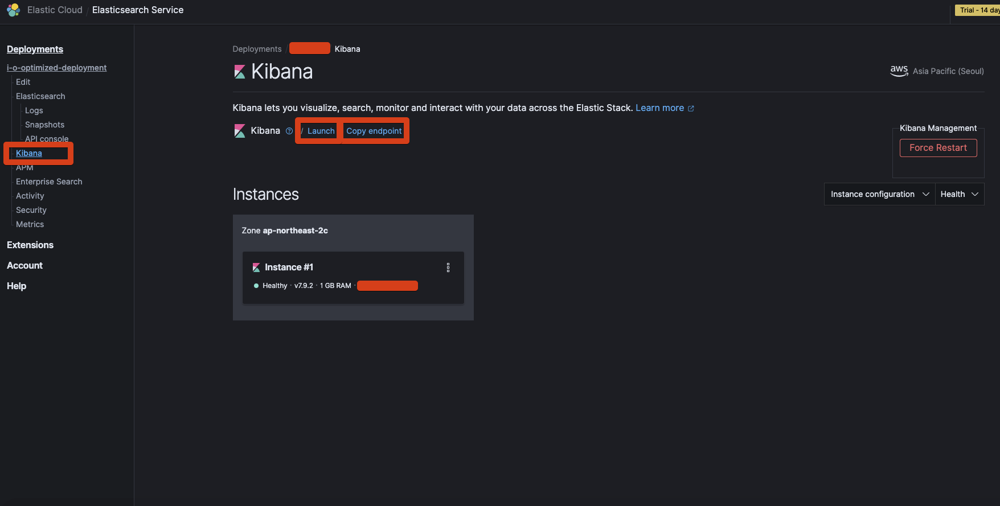
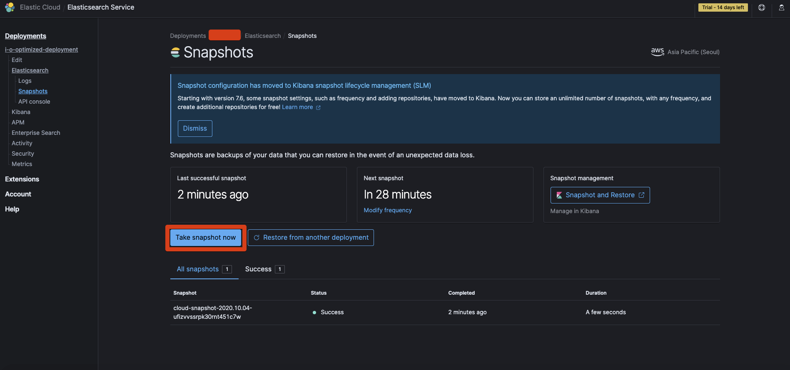

# Elastic Cloud 개설

[velog.io/@gosgjung](https://velog.io/@gosgjung/chartnomy-Elastic-Cloud-%EA%B0%9C%EC%84%A4) 에 정리한 내용들을 백업하려는 용도로 기록으로 남겨놓았다.  

Elastic Search, Logstash, Kibana 를 EC2에 깔고 실행했는데 역시나 EC2 t2.micro에서는 리소스가 많이 부족했다. 그러던 중에 고려해봤던 사항은 아래의 두 가지 였다.

- EC2 확장
  - 이번기회에 큰걸 하나 개설할까?
  - AWS EKS 등을 적용할 예정이었는데, 추후 비용을 어느정도 더 지불해도 되겠다는 생각이 들었으나, 아직은 도입할 시점은 아니겠다는 생각이 들었다.
- Elastic Cloud 구독
  - 한달에 16$ 짜리 하나 질러서 일단은 테스트해보자.
  - Elastic에서 관리해주는 ELK 전용 Cloud 이니까, 내가 관리할 것들이 많이 줄어든다는 점에서는 마음에 들었다.  

  

---
**2020/10/07 현재**  
ElastciCloud 구독이 아직은 결제단계는 아니고 평가판 단계이다. 모 클라우드 서비스처럼 바로 카드번호를 물어보지 않는 점은 마음에 든다.  

나중에 평가판 날짜가 지나면 결제정보 입력하는 화면도 기록?기념으로 남겨놓을 예정이다.ㅋㅋ  

  

# Elastic Cloud 
[elastic.co.kr/pricing/](https://www.elastic.co/kr/pricing/)  

  
스탠더드 버전을 선택했다.  

돈을 내기 위해 로그인 ㅋㅋ  

  

구글 계정으로 로그인 했다 ㅋㅋ  
  

Elastic Stack 선택  

hardware profile 을 선택하라고 하는데 I/O Optimized 를 선택했다  

---
Deployment 인스턴스를 선택해주어야 하는데, Azure가 기본값이고, 지역은 미국이 기본값이다. 
  

Expand를 눌러서 메뉴를 확장해주자.  

Elastic 버전은 따로 선택할 수 있다. 현재 6.x 와 7.x 가 주요 버전인데, 6.x에서 지원되던 문법들이 7.x버전 대에서 Deprecated 된 요소들이 많은 관계로 7.x를 선택했다.  

인스턴스의 종류를 선택하자.  
사용할 수 있는 인스턴스의 종류는 아래와 같다.  

- Google Cloud
- Azure
- Amazon Web Service  

를 선택하도록 나타나는데 위의 세가지 모두 클릭해봤는데 region으로 한국을 선택할 수 있는 것은 AWS밖에 없어서 AWS를 선택했다.  
  

선택을 마쳤다면 Create deployment 클릭  

  

---
임시 패스워드가 발급된다. Download 버튼을 누르면 csv 파일로 계정정보가 다운로드된다.  
  

  

---
인스턴스가 생성되고 있는 모습  
  

  

---
생성이 완료되고 나면 아래와 같이 Copy endpoint 버튼을 눌러서 api url 을 복사할 수 있다.  
    

   

---
Kibana 화면이다.  
Launch, copy endpoint  
  

---
설치 초기 설정을 스냅샷으로 남겨두려면 아래처럼 Take snapshot now 버튼을 클릭한다.
  

---

  

