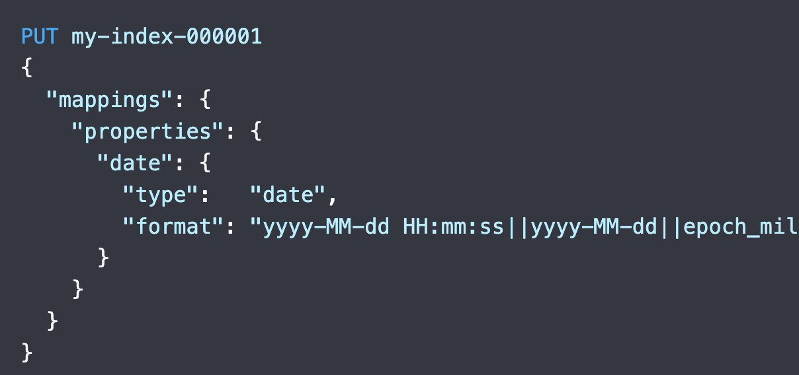
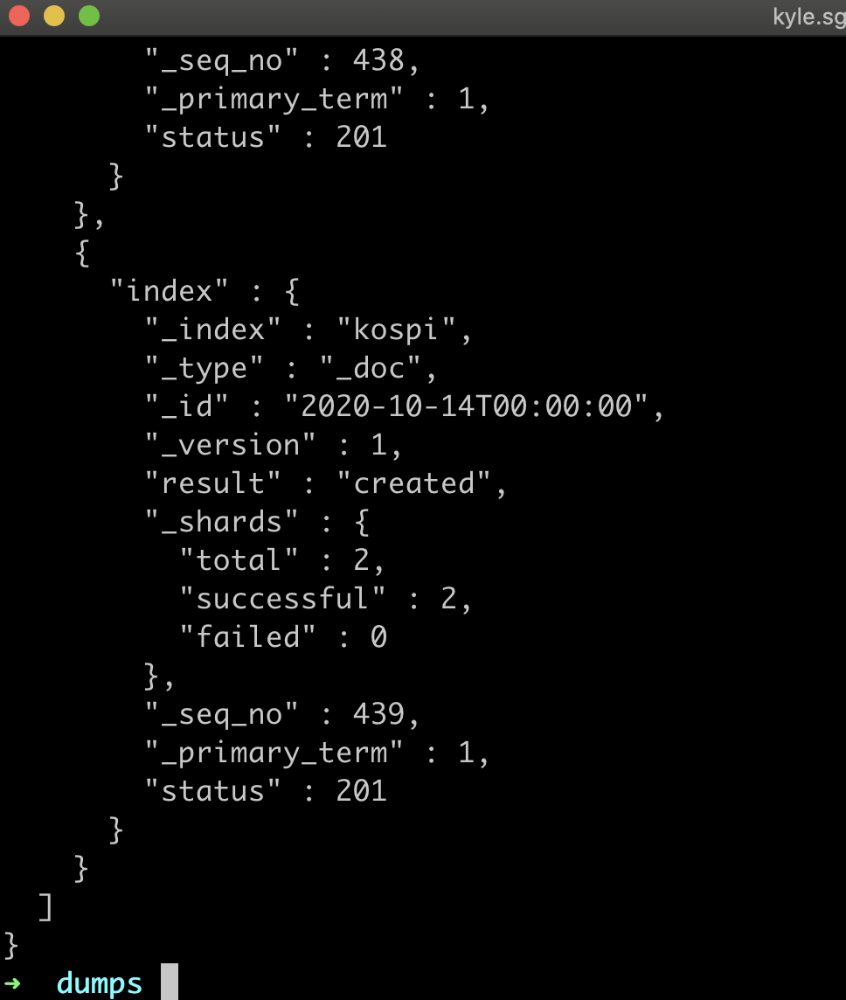
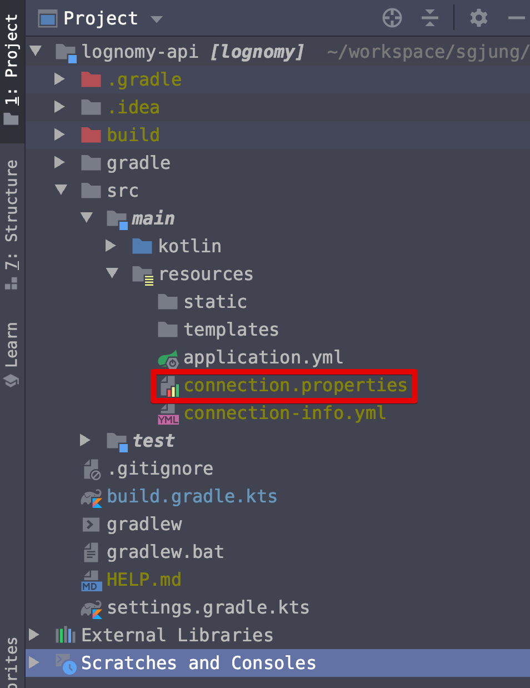
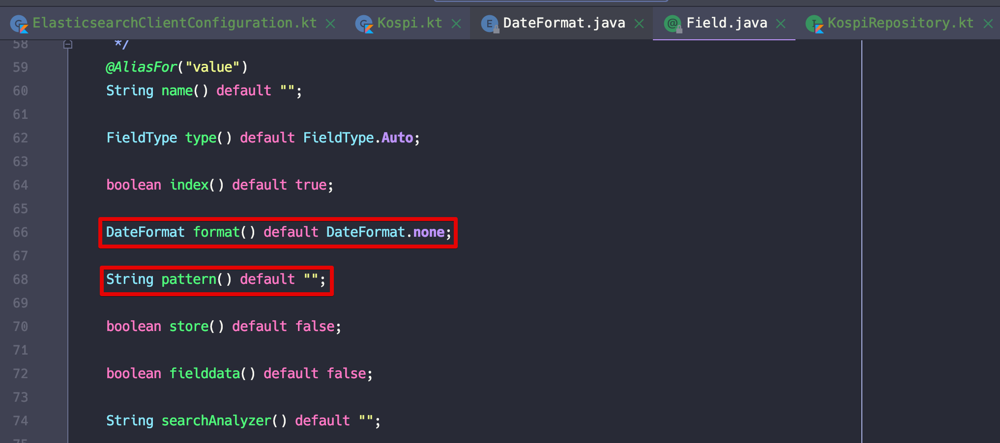
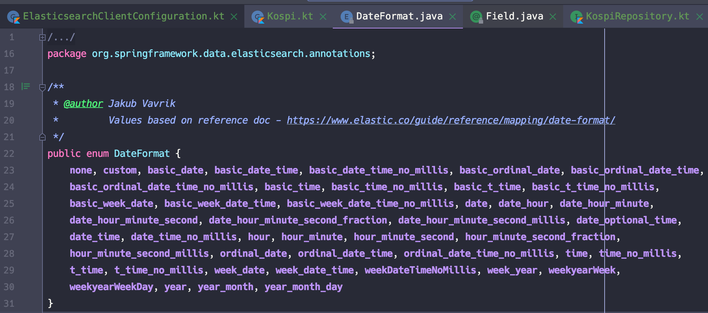

이 글은 [velog](https://velog.io/@gosgjung/chartnomy-ELK-Cloud-Bulk-Insert-%EB%B0%8F-Mapping-SpringBoot-%EC%84%A4%EC%A0%95-%EB%B0%8F-%ED%85%8C%EC%8A%A4%ED%8A%B8) 에 정리했던 내용을 백업하기 위해 남긴다.

  

[(chartnomy) ELK Cloud - 경제지표 데이터 Bulk Insert](https://velog.io/@gosgjung/chartnomy-ELK-Cloud-%EA%B2%BD%EC%A0%9C%EC%A7%80%ED%91%9C-%EB%8D%B0%EC%9D%B4%ED%84%B0-Bulk-Insert)

이전 글을 수정하려다가 시간이 너무 오래걸릴것 같아서 
이전 글에 이어서 작성한다. 내일 내지 주말에 기존의 글을 수정하게 될 것 같다.

  

# 기존 인덱스 삭제

우선 기존 인덱스를 삭제하자. 삭제 명령은 키바나 콘솔에서 수행했다.
```bash
DELETE /kospi
```


  

# 인덱스 생성 + 매핑 적용

인덱스 생성과 매핑을 적용하는 단계이다. 인덱스를 매핑하는 작업은 관계형 데이터베이스에 빗대어 생각해보면 테이블의 각 필드의 자료형을 지정해주는 Alter 문과 비슷한 과정이다.  

### 참고자료
- 인덱스 매핑
  
  - [https://www.elastic.co/guide/en/elasticsearch/reference/current/mapping.html](https://www.elastic.co/guide/en/elasticsearch/reference/current/mapping.html)
- `Explicit Mappings` 
  - 인덱스 매핑을 하는 여러가지 방식을 설명한다.
  - 종류는 아래와 같다.
    - 인덱스 생성과 동시에 매핑 적용(권장)
    - 기존 매핑에 필드 추가
  - [https://www.elastic.co/guide/en/elasticsearch/reference/current/mapping.html#_explicit_mappings](https://www.elastic.co/guide/en/elasticsearch/reference/current/mapping.html#_explicit_mappings)
  
- ElasticSearch 의 SQL Data Type 들
  - ElasticSearch 의 Data Type 들에 대해 리스팅 되어 있는 자료
  - [https://www.elastic.co/guide/en/elasticsearch/reference/current/sql-data-types.html](https://www.elastic.co/guide/en/elasticsearch/reference/current/sql-data-types.html)
- 데이트 타입 매핑시 DateFormat 관련 자료
  
  - [https://www.elastic.co/guide/en/elasticsearch/reference/current/mapping-date-format.html](https://www.elastic.co/guide/en/elasticsearch/reference/current/mapping-date-format.html)
- 데이트 타입 매핑시 포매팅 속성 지정 관련 자료
  - [https://www.elastic.co/guide/en/elasticsearch/reference/current/date.html](https://www.elastic.co/guide/en/elasticsearch/reference/current/date.html)

   



위의 자료들을 참고해 매핑을 적용한 모습은 아래와 같다. 가운데에 'T'가 들어간 날짜 형식을 ISO 포맷이라고 부른다. 'T'가 들어가지 않고도 일라스틱 클라우드에 매핑과 Bulk Insert 모두 가능하다.  

  

하지만 Spring Data ElasticSearch 에서는 시/분/초 이상의 단위를 사용할때 isoformat 만을 지원하고 있다. ([https://www.elastic.co/guide/en/elasticsearch/reference/current/mapping-date-format.html](https://www.elastic.co/guide/en/elasticsearch/reference/current/mapping-date-format.html))  

  

다른 형식 모두 괜찮긴 한데 시/분/초 까지 적용되게끔 하려면 Spring Data ElasticSearch에서는 isoformat만을 지원하기 때문에 가급적 ’T’가 포함된 ISO Format을 사용하는 것이 권장된다.


실제로 사용한 명령어이다.  

```bash
PUT /kospi
{
    "mappings": {
        "properties": {
            "UNIT_NAME": {
                "type": "text"
            },
            "STAT_NAME": {
                "type": "text"
            },
            "ITEM_CODE1": {
                "type": "text"
            },
            "STAT_CODE": {
                "type": "text"
            },
            "ITEM_CODE2": {
                "type": "text"
            },
            "ITEM_CODE3": {
                "type": "text"
            },
            "ITEM_NAME1": {
                "type": "text"
            },
            "ITEM_NAME2": {
                "type": "text"
            },
            "DATA_VALUE": {
                "type": "double"
            },
            "ITEM_NAME3": {
                "type": "text"
            },
            "TIME": {
                "type": "date",
                "format": "yyyy-MM-dd'T'HH:mm:ss||yyyy-MM-dd||epoch_millis||yyyyMMdd"
            }
        }
    }
}
```


# 벌크데이터 생성

벌크 데이터를 새로 생성했다. 이전 버전은 Date를 텍스트로 INSERT 했었는데, 
Time 필드의 경우 Text로 그대로 json 파일에 넣었고, 매핑시에도 text 타입으로 매핑했었다. 하지만 이 경우 Spring Data ElasticSearch 연동시 LocalDateTime 필드로 연동할때 에러를 낸다. Spring Data ElasticSearch 에서 지원하는 DateFormat 을 사용해야 한다.  

  

따라서 벌크데이터 생성시 Spring Data ElasticSearch 에서 지원하는 DateFormat에 맞게끔 넣어주어야 한다. 이번 차례에서는 이렇게 Spring Data ElasticSearch에서 인식할수 있는 ISO Format 의 시간 문자열로 매핑해주는 파이썬 코드들을 정리해보려 한다.  


## 참고자료
- json dumps 시에 딕셔너리 데이터를 json으로 stringfied 해서 저장할때 datetime 타입에 대한 에러 발생시 해결법
    - 데코레이터의 개념을 활용하고, json.dump가 datetime 객체에 대한 toString 을 찾지 못하는 문제에 대해 __str__() 을 사용하는 예제를 다루고 있다. 
    - 매우 도움이 되었다.
    - [https://code-maven.com/serialize-datetime-object-as-json-in-python](https://code-maven.com/serialize-datetime-object-as-json-in-python)

  

## 전체 코드
```python
import urllib3
import json
import os
import datetime


date_formatter = '%Y%m%d'


COLUMN_LIST = [
        'STAT_NAME',  'STAT_CODE',  'ITEM_CODE1', 'ITEM_CODE2', 'ITEM_CODE3',
        'ITEM_NAME1', 'ITEM_NAME2', 'ITEM_NAME3', 'DATA_VALUE', 'TIME'
    ]


api_key = '--'


# TODO 정리필요 (1)
# Object of type datetime is not JSON serializable 에러에 대해서 아래의 custom_converter() 함수를 사용하면 된다.
# 원리는 datetime 객체내의 __str__ 을 통해 toString 효과를 내도록 하는 것.
# datetime 객체 자체가 json 모듈안에서 기본으로 지원되지 않는 듯 하다.
# https://code-maven.com/serialize-datetime-object-as-json-in-python


def custom_converter(obj):
    if isinstance(obj, datetime.datetime):
        return obj.isoformat().__str__()


# TODO 정리필요 (2)
# 매핑코드 변경된 내용들 정리(원리 및 벨로그 업데이트) 필요함


if __name__ == '__main__':
    url = "http://ecos.bok.or.kr/api/StatisticSearch/{}/json/kr/1/50000/064Y001/DD/20190101/20201231/0001000" \
        .format(api_key)


    print(" ####### URL #######")
    print(url)


    http = urllib3.PoolManager()
    ret = http.request("GET", url, headers={'Content-Type': 'application/json'})


    str_response = ret.data.decode('utf-8')
    dict_data = json.loads(str_response)


    arr_data = dict_data['StatisticSearch']['row']


    directory = 'json/document/'
    if not os.path.exists(directory):
        os.makedirs(directory)


    # index, id 추가 안할 때의 데이터
    # with open('json/document/kospi_data.json', 'w+') as f:
    #     for e in arr_data:
    #         stringified_json = json.dumps(e)
    #         stringified_json = stringified_json + "\n"
    #         print(stringified_json)
    #         f.write(stringified_json)


    # index, id 추가 한 후의 데이터
    # type 역시 추가
    with open('json/document/kospi_data_20201014_isoformat.json', 'w+') as f:
        for e in arr_data:
            # type 을 지정할 경우 (7.x 아래 버전)
            # dict_index = {'index': {'_index': 'indicators', '_type': 'kospi', '_id': e['TIME']}}


            # type 을 지정하지 않을 경우 (7.x 부터)
            # datetime 타입으로 변환
            e['TIME'] = datetime.datetime.strptime(e['TIME'], date_formatter)


            dict_index = {'index': {'_index': 'kospi', '_id': e['TIME']}}
            str_index_id = json.dumps(dict_index, default=custom_converter)
            stringified_json = str_index_id + "\n"


            stringified_json = stringified_json + json.dumps(e, default=custom_converter)
            stringified_json = stringified_json + "\n"
            print(stringified_json)
            f.write(stringified_json)
```

## 1) datetime 타입의 객체를 stringify 하려면?
[https://code-maven.com/serialize-datetime-object-as-json-in-python](https://code-maven.com/serialize-datetime-object-as-json-in-python)  

딕셔너리 타입의 데이터를 json stringify 를 해서 저장하려 할 때 에러를 낸다.
에러문구는 'Object of type datetime is not JSON serializable' 이다.  

  

json 모듈에서는 datetime 객체에 대한 toString 역할을 하는 함수가 제공되지 않는 것으로 보인다. 이런이유로 커스텀 포매팅을 하는 함수를 선언해서 해당 객체에 대해서 __str__() 을 호출하도록 해주면 된다.  

```python
def custom_converter(obj):
    if isinstance(obj, datetime.datetime):
        return obj.isoformat().__str__()

...


if __name__ == '__main__':

    # ...

    # type 역시 추가
    with open('json/document/kospi_data_20201014_isoformat.json', 'w+') as f:
        for e in arr_data:

            # datetime 타입으로 변환
            e['TIME'] = datetime.datetime.strptime(e['TIME'], date_formatter)

            # index 표현 용도 딕셔너리에 임시저장
            dict_index = {'index': {'_index': 'kospi', '_id': e['TIME']}}
            
            # custom_converter 를 데코레이터로 해서 json.dumps 를 수행
            str_index_id = json.dumps(dict_index, default=custom_converter)
            stringified_json = str_index_id + "\n"

            # body 부분을 json 문자열인 stringified_json 에 저장
            stringified_json = stringified_json + json.dumps(e, default=custom_converter)
            # 이건 왜 했었는지 나도 잘 모르겠다.
            stringified_json = stringified_json + "\n"

    # ...
```


## 2) ISO Format의 datetime으로 변환 후 문자열로 바꾸려면?

datetime 객체에는 isoformat() 이라는 이름의 함수가 있다. 이 함수를 통해 iso 형식의 datetime 객체를 먼저 만들고나서, __str__() 함수를 통해 stringify를 진행하는 코드는 아래와 같다.   

그리 어려운 코드는 아니니 이 정도에서 설명을 마치는게 나을듯하다.  
```python
def custom_converter(obj):
    if isinstance(obj, datetime.datetime):
        return obj.isoformat().__str__()
```


## 파이썬의 datetime 형식 변환함수

- datetime 을 문자열로 바꿀때에는
    - 포매팅, formatting, 약자로 ftime
    - datetime.datetime.stftime 
- 문자열을 원하는 형식의 datetime으로 바꾸거나, datetime으로 바꿀때에는
    - 프로세싱, processing, 약자로 ptime
    - datetime.datetime.strptime


# CURL 을 이용한 Bulk Insert 작업

Spring Data ElasticSearch, QueryDsl 등을 이용해 Bulk Insert를 수행할 수 있기는 하다. 하지만 초기 데이터는 CURL 을 이용해 Bulk Insert 하려고 한다. 정말 아무것도 없는 개발 초기상태이기 때문이다.   

정상적으로 동작하는 Bulk Insert 명령어는 아래와 같다.   
```bash
$ curl -X POST -H 'Content-Type: application/json' \
--user elastic:ZMDnxlVzyQkGQwrYDOh9nkl9 \
https://a2580127b5fa47a783245a38d16c6a76.ap-northeast-2.aws.elastic-cloud.com:9243/kospi/_bulk?pretty \
--data-binary @kospi_data_20201014_isoformat.json
```

Insert가 정상적으로 수행된 모습은 아래와 같다.  




# Spring Data JPA 에서의 작업  

주의할 점이 두 가지 있다.  
## 주의할 점
- connection 정보를 버전관리 되지 않도록 보호해야 한다는 점이다. (.gitignore 로 등록)
  - 회사 내부 private github라면 무관하다. 
  - public 리포지터리라면, gitignore로 등록해두어야 한다. 비트코인 채굴 및 악성 봇에 악용될 소지가 있기 때문이다.
- https://, http:// 와 같은 접두사를 접속정보에서 제거할 것
    - [https://stackoverflow.com/questions/62552911/unable-to-connect-my-java-application-to-the-elastic-stack-instance](https://stackoverflow.com/questions/62552911/unable-to-connect-my-java-application-to-the-elastic-stack-instance)
    - ex) Configuration 코드에 elasticsearch의 host를 아래와 같이 지정해주면 된다.
        - a2580127b5fa47a783245a38d16c6a76.ap-northeast-2.aws.elastic-cloud.com


## Elastic Cloud 접속 정보 설정

프로젝트의 구조는 아래와 같다. 아래에 보이듯이 connection.properties 라는 파일이 있다.  




이 connection.properties 파일에는 아래와 같은 접속정보들을 입력해두었다.   

  

주의할 점은 https://, http:// 와 같은 접두사를 URL에서 제거한 문자열을 elastic search의 host로 사용해야 ElasticSearch High Level Client 라는 라이브러리와 정상적으로 연동된다.   

```properties
# rds 접속 정보 등등…

# TODO 정리 필요 https:// 또는 http:// 를 제거해야 한다.
# https://stackoverflow.com/questions/62552911/unable-to-connect-my-java-application-to-the-elastic-stack-instance

# 이건 잘못된 주소 형식이다. https:// 를 제거하자
# conn.elasticsearch.host=https://f765633ef8c84c4a9fb0b0f8f24ad84d.ap-northeast-2.aws.elastic-cloud.com
# http:// 를 제거한 문자열을 java config 시 사용해야 한다. (ElasticSearch 라이브러리 내부에서 통용되는 형식이라 조금 어쩔수 없는 부분)
conn.elasticsearch.host=f765633ef8c84c4a9fb0b0f8f24ad84d.ap-northeast-2.aws.elastic-cloud.com

conn.elasticsearch.port=9243
conn.elasticsearch.cluster_name=a2580127b5fa47a783245a38d16c6a76
conn.elasticsearch.username=elastic
conn.elasticsearch.password=ZMDnxlVzyQkGQwrYDOh9nkl9


spring.main.allow-bean-definition-overriding=true
```


### 참고자료   

- [https://stackoverflow.com/questions/62552911/unable-to-connect-my-java-application-to-the-elastic-stack-instance](https://stackoverflow.com/questions/62552911/unable-to-connect-my-java-application-to-the-elastic-stack-instance)  

ex) 
- a2580127b5fa47a783245a38d16c6a76.ap-northeast-2.aws.elastic-cloud.com

  

### PropertySourceConfiguration

스프링 로딩시 src/main/resources 밑의 connection.properties 파일을 읽을수 있도록 아래와 같이 설정해주었다.
```kotlin
package io.chart.lognomy.config


import org.springframework.context.annotation.Configuration
import org.springframework.context.annotation.PropertySource


@Configuration
@PropertySource("classpath:/connection.properties")
class PropertySourceConfig {
}
```

  

## Configuration

Configuration 파일은 아래와 같다. 

아직은 단순설정만 적용된 상태이긴 하지만 추후 Reactive Programing 방식으로 변경예정이다.   

```kotlin
package io.chart.lognomy.config


import org.apache.http.Header
import org.apache.http.message.BasicHeader
import org.elasticsearch.client.RestHighLevelClient
import org.springframework.beans.factory.annotation.Value


import org.springframework.context.annotation.Bean
import org.springframework.context.annotation.Configuration
import org.springframework.data.elasticsearch.client.ClientConfiguration
import org.springframework.data.elasticsearch.client.RestClients
import org.springframework.data.elasticsearch.config.AbstractElasticsearchConfiguration
import org.springframework.data.elasticsearch.repository.config.EnableElasticsearchRepositories
import org.springframework.http.HttpHeaders
import java.time.Duration
import java.util.*


/*
    TODO 정리 필요
    cluster name 을 얻어오는 방식은 https://www.elastic.co/guide/en/elasticsearch/reference/current/cluster-state.html 에 자세히 설명되어 있다.
    이 중 curl -X GET "localhost:9200/_cluster/state/blocks?pretty" 을 선택했다.
 */


//@EnableElasticsearchRepositories
@Configuration
class ElasticsearchClientConfiguration (
        @Value("\${conn.elasticsearch.host}") val host: String,
        @Value("\${conn.elasticsearch.port}") val port: String,
        @Value("\${conn.elasticsearch.cluster_name}") val clusterName: String,
        @Value("\${conn.elasticsearch.username}") val username: String,
        @Value("\${conn.elasticsearch.password}") val password: String
) : AbstractElasticsearchConfiguration() {


    // AbstractElasticsearchConfiguration 클래스 내에 abstract 메서드에서, 반드시 implements 해야 한다.
    // 이런점은 확실히 마음에 든다.
    @Bean
    override fun elasticsearchClient(): RestHighLevelClient {
        val hostAndPort = "$host:$port"


        // java.net.UnknownHostException elasticsearch 검색내용
        // https://discuss.elastic.co/t/java-net-unknownhostexception-using-java-rest-client-5-6-3/106329/17
        // https://discuss.elastic.co/t/java-net-unknownhostexception-using-java-rest-client-5-6-3/106329/18
        // https://discuss.kotlinlang.org/t/how-to-call-string-getbytes/2152
        val encodedBytes : String = Base64.getEncoder().encodeToString("$username:$password".toByteArray())
//        val headers = mutableListOf<Header>()
//        headers.add(BasicHeader(HttpHeaders.CONTENT_TYPE, "application/json"))
//        headers.add(BasicHeader("Authorization", "Basic $encodedBytes"))


        val httpHeaders: HttpHeaders = HttpHeaders()
        httpHeaders.add("Content-Type", "application/json");
        httpHeaders.add("Authorization", "Basic $encodedBytes")


        val clientConfiguration : ClientConfiguration = ClientConfiguration.builder()
                .connectedTo(hostAndPort)
                .usingSsl()
                .withConnectTimeout(Duration.ofSeconds(5))
                .withSocketTimeout(Duration.ofSeconds(5))
                .withDefaultHeaders(httpHeaders)
//                .withBasicAuth(username, password)
//                .usingSsl()
//                .withProxy("asdf")
//                등등 굉장히 많은 설정이 있다.
//                자세한 내용은 아래 링크 참고
//                https://docs.spring.io/spring-data/elasticsearch/docs/current/reference/html/#elasticsearch.clients.configuration
                .build()


        return RestClients.create(clientConfiguration).rest()
    }

}
```

  

### 참고자료

참고자료는 스프링 공식문서를 참고했다.
- [https://docs.spring.io/spring-data/elasticsearch/docs/current/reference/html/#elasticsearch.clients.rest](https://docs.spring.io/spring-data/elasticsearch/docs/current/reference/html/#elasticsearch.clients.rest) 

  

그리고 Unknown Host Exception 에러가 발생해서 아래의 자료 역시 참고했다.  

- 검색어
    -  search.core.ElasticsearchRestTemplate.translateException
- [unknown host exception 관련 Elastic 포럼 게시글](https://discuss.elastic.co/t/java-net-unknownhostexception-using-java-rest-client-5-6-3/106329)  


## Entity

### 참고자료
엔티티 매핑시 참고한 자료이다.
- [https://docs.spring.io/spring-data/elasticsearch/docs/current/reference/html/#elasticsearch.mapping.meta-model.annotations](https://docs.spring.io/spring-data/elasticsearch/docs/current/reference/html/#elasticsearch.mapping.meta-model.annotations)   

  

그리고 ISO FORMAT 형식의 시간문자에 대한 포맷역시 확인해야 했기에 아래의 자료 역시 참고했다.  

-  [https://www.elastic.co/guide/en/elasticsearch/reference/current/mapping-date-format.html](https://www.elastic.co/guide/en/elasticsearch/reference/current/mapping-date-format.html)  

### 엔티티 매핑

@Field 안에서 format, pattern 이 어떤 Java의 어떤 데이터 타입인지 공식문서에 나와있지 않아서 잠깐 막막했었다. 그래서 @Field 어노테이션 내부구현을 참고해본 결과 아래와 같이 
* format() : DateFormat - org.springframework.data.elasticsearch.annotations.DateFormat, enum이다.
* pattern() : String  
과 같았다.  

날짜의 format과 pattern을 지정해주는 @Field 내의 필드들은 아래와 같다.  



  



이렇게 이것 저것 참고해가며 완성한 엔티티 매핑은 아래와 같다   


### Kospi.kt
```kotlin
package io.chart.lognomy.indicators.kospi


import org.springframework.data.annotation.Id
import org.springframework.data.elasticsearch.annotations.DateFormat
import org.springframework.data.elasticsearch.annotations.Document
import org.springframework.data.elasticsearch.annotations.Field
import org.springframework.data.elasticsearch.annotations.FieldType
import java.time.LocalDateTime


// 참고자료
// https://docs.spring.io/spring-data/elasticsearch/docs/current/reference/html/#elasticsearch.clients.rest


@Document(indexName = "kospi", createIndex = false)
data class Kospi(
        @Id @Field(name = "TIME", type = FieldType.Date, pattern = "yyyy-MM-dd'T'hh:mm:ss", format = DateFormat.date_hour_minute_second)
        val time : LocalDateTime,


        @Field(name = "DATA_VALUE", type = FieldType.Text) val value: String,
        @Field(name = "ITEM_CODE1", type = FieldType.Text) val itemCodeOne : String,
        @Field(name = "ITEM_CODE2", type = FieldType.Text) val itemCodeTwo : String,
        @Field(name = "ITEM_CODE3", type = FieldType.Text) val itemCodeThree : String,
        @Field(name = "ITEM_NAME1", type = FieldType.Text) val itemNameOne : String,
        @Field(name = "ITEM_NAME2", type = FieldType.Text) val itemNameTwo : String,
        @Field(name = "ITEM_NAME3", type = FieldType.Text) val itemNameThree : String,
        @Field(name = "STAT_NAME", type = FieldType.Text) val statName : String,
        @Field(name = "STAT_CODE", type = FieldType.Text) val statCode : String,
        @Field(name = "UNIT_NAME", type = FieldType.Text) val unitName : String
)
```

  

## Repository, Service

엔티티 까지 모두 작성했다. Repository, Service의 내용은 크게 어려운 내용이 없다. 

  

### Repository

KospiRepository.kt
```kotlin
package io.chart.lognomy.indicators.kospi

import org.springframework.data.elasticsearch.repository.ElasticsearchRepository
import org.springframework.data.repository.Repository

import java.time.LocalDateTime

// 일부 인터넷 자료를 보면 아래 주석친 부분과 같은 내용들이 나오는데, 현재 시점의 최신버전인 ElasticSearch 7.x 에서는 통하지 않는다.
// Jackson 등과 같은 라이브러리 지원 등을 제거하면서 대폭 바뀌었기 때문이다.
//@Repository("kospiRepository")
//interface KospiRepository : ElasticsearchRepository<Kospi, LocalDateTime>{

// 이게 정상적으로 동작하는 코드이다. 빌트인(??)으로 제공되는 spring data jpa 를 가져다 쓰면 된다.
interface KospiRepository : Repository<Kospi, LocalDateTime> {
    fun findAllBy(): List<Kospi>
}
```

  

### Service

KospiService.kt  
```kotlin
package io.chart.lognomy.indicators.kospi

import org.springframework.stereotype.Service

@Service
class KospiService (
        val kospiRepository: KospiRepository
){
    public fun findAll(): List<Kospi> {
        return kospiRepository.findAllBy().toList()
    }
}
```

  

## 테스트 코드  

대망의 테스트 코드이다.   


### KospiTest.kt
```kotlin
package io.chart.lognomy.indicators.kospi


import org.junit.jupiter.api.BeforeEach
import org.junit.jupiter.api.DisplayName
import org.junit.jupiter.api.Test
import org.springframework.beans.factory.annotation.Autowired
import org.springframework.beans.factory.annotation.Qualifier
import org.springframework.boot.test.context.SpringBootTest


@SpringBootTest
class KospiTest {


    lateinit var kospiService: KospiService


    @Qualifier("kospiRepository")
    @Autowired
    lateinit var kospiRepository: KospiRepository


    @BeforeEach
    fun setup() : Unit{
        kospiService = KospiService(kospiRepository)
    }


    @Test
    @DisplayName("findAll")
    fun testFindAll() : Unit{
        val findAll = kospiService.findAll()
        println(findAll)
    }
}
```

  

### 출력결과

잘된다~ 아휴... (땀 뻘뻘...) ㅋㅋ


  

