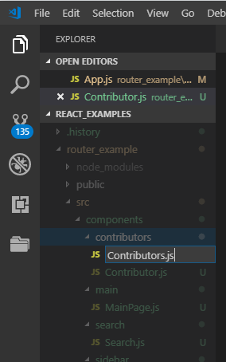
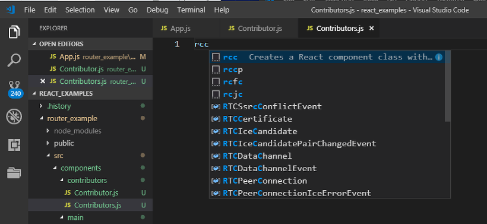
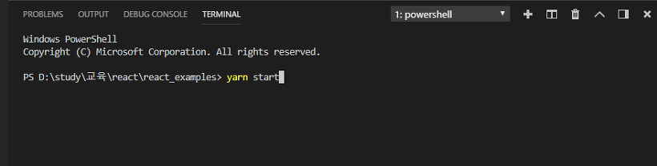
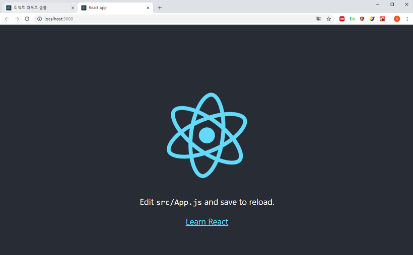

# React의 1단 구조 라우터
거의 2년 전쯤(2019.2.4)에 직접 운영했었던 블로그에 남겼던 글인 [https://silentcargo.tistory.com/129](https://silentcargo.tistory.com/129) 을 백업용도 및 수정 + 보완 용도로 작성합니다. 티스토리가 계정을 말소시키고 카카오 계정으로 통합한다는 이야기가 있어서 부랴부랴 백업중입니다~  

# CRA + 의존성 추가
```bash
$ yarn create react-app router_example
# react 프로젝트 생성 명령어이다. 명령어의 형식은 yarn create react-app [프로젝트명] 이다.

$ cd router_example
# 프로젝트 디렉터리로 이동합니다.

$ yarn add react-router-dom
# react 생태계에서 가장 대중적으로 쓰이는 라우팅 라이브러리인 react-router-dom을 다운로드.

$ yarn add qs
# HTML5의 location API를 사용할때 QueryString을 분해하는 유용한 라이브러리를 다운로드. RequestParam과 같은 형태로 url이 구성될때 사용한다.
```
- react-router-dom
  - 리엑트에서 라우터를 사용할 때 사용하는 라이브러리이다.
- qs
  - 일반적으로 QueryString을 분해할 때 사용하는 유틸리티성 라이브러리이다.

# 프로젝트 구동방법 (로컬)
yearn create react-app [원하는 프로젝트명] 으로 생성한 프로젝트 디렉터리를 vscode로 열어본 모습은 아래와 같습니다.  



  

이제 vscode 상단의 [Terminal]>[New Terminal...]을 통해 터미널을 엽니다.  



  

하단에 나타나는 터미널에서 yarn start를 입력해보시기 바랍니다.




yarn start 명령을 실행시키고 나면 아래와 같은 hello world 같은 화면이 나타납니다.  



이 화면은 react 에서 공식으로 제공해주는 샘플 페이지이며, 생성된 프로젝트 내에서 App.js, App.css를 찾아서 확인해보시면 내부의 내용을 확인하실 수 있습니다. App.js를 로드하는 곳은 index.js입니다. 이에 대한 소스도 확인해보시면 공부에 도움이 되실 듯합니다.  

vscode에서 파일을 찾는 단축키는 Ctrl + P 입니다. Ctrl+P를 눌러서 나온 팝업창에 파일이름을 입력하면 자동으로 이름이 비슷한 파일 혹은 관련 파일들을 추천해주니, 이 단축키를 통해 찾으시면 수월할 듯 합니다.

# 만들고자 하는 페이지의 대강의 모습
AngularJS 시절에 yeoman(요맨)이라는 툴을 이용해 AngularJS 프로젝트를 구성하고 나면 아래와 같은 화면이 나타났었습니다.  

    
위와 같이 요맨 설명 페이지와 유사해보이는 네비게이션 바를 만들어보려고 하는게 이번글의 목표입니다. 

**메인 페이지**


**Contributors 메뉴**


**Contributors 메뉴 - 파라미터 바인딩**
아래는 Path Variable 처럼 생긴 아래와 같은 형식으로 파라미터를 라우터에 넘기는 예제입니다.
> http://localhost:3000/contributors/변수에 전달하려는 값

Contributors 아래의 가장 아래의 항목인 aladdin을 클릭했을때 아래와 같이 해당되는 데이터를 가져옵니다.


**search 메뉴**
네비게이션 바에서 Search 를 클릭했을때 나타나는 페이지는 아래와 같습니다.


**search 메뉴 - 파라미터 바인딩**  
request param과 같은 형식으로 파라미터를 전달했을때의 결과페이지입니다.  
  

# 프로젝트 구조 세팅

각각의 기능(contributor, main, search, sidebar)을 컴포넌트로 취급하여 components라는 디렉터리에 같은 이름으로 생성하여 기초적인 프로젝트의 구조를 잡는 과정입니다.  

조금 전에 Node.js, Yarn을 설치하고 나서 yarn create react-app [프로젝트 명] 으로 프로젝트를 세팅했습니다. yean으로 npm의 공식 리포지터리에서 react 구성을 세팅했습니다. 

생성할 디렉터리들의 구조를 정리해보면 아래와 같습니다.
```text
router_example

|_....

|_src

   |_components     # 생성할 디렉터리 (생성해줍니다. 이름은 무관)

   |    |_contributor   # 생성할 디렉터리 (생성해줍니다. 이름은 무관)

   |    |_main           # 생성할 디렉터리 (생성해줍니다. 이름은 무관)

   |    |_search         # 생성할 디렉터리 (생성해줍니다. 이름은 무관)

   |    |_sidebar        # 생성할 디렉터리 (생성해줍니다. 이름은 무관)

   |- App.js

   |- App.css

   |- ...
```

생성한 디렉터리들의 캡처화면 입니다.


# UI 기본구조 세팅(index.js, App.js, Sidebar.css)
## 사이드바 css 생성
아래와 같이 Sidebar.css 파일을 생성해줍니다.


생성된 Sidebar.css에는 아래와 같은 내용을 입력해줍니다.
- 파일명 : 
  - Sidebar.css 
- 경로 : 
  - src/components/sidebar/Sidebar.css

Sidbebar.css 내용  
(노총각+남자 개발자가 만들어서인지... 디자인이 조금 허접합니다... 양해부탁드립니다...)
```css
/* 왼쪽 사이드바 */
.all{
    display: inline;
}
.sidebar {
    /* div 가로 정렬 */
    display:inline;
    float:left;
    width:300px;

    /* background-color 지정 */
    background-color: #343a40;

    /* 왼쪽 전부 차지하도록  */
    position: fixed;
    overflow: auto;
    height: 100%;
}

/* 오른쪽 컨텐츠 영역 */
/* http://alik.info/p/7 */
.page-area {
    /* div 가로 정렬 */
    display:inline;
    position: absolute;
    width:auto;
    margin-left:300px;
    height:100%;
    float: right;
}

.sidebar > ul{
    list-style-type: none;
    margin: 0;
    padding: 0;
}
  
.sidebar > ul > li a {
    display: block;
    width: 300px;
    color: #000;
    padding: 8px 16px;
    text-decoration: none;
    font-weight: 900;
    color: #dbe4ff;
}
  
.sidebar > ul> li a:hover{
    background-color: #555;
    color: white;
}

.sidebar > ul > li .active{
    background-color: #4CAF50;
    color: white;
}
```

## Index.js
react의 라우터인 react-router를 사용하기 위해서는 index.js 파일에 아래의 선언문을 추가해주어야 합니다.
> import {BrowserRouter} from 'react-router-dom';

```javascript
import React from 'react';
import ReactDOM from 'react-dom';
import './index.css';
import App from './App';
import * as serviceWorker from './serviceWorker';
import {BrowserRouter} from 'react-router-dom';

ReactDOM.render( 
    <BrowserRouter>
        <App/>
    </BrowserRouter>,
    document.getElementById('root')
);

// If you want your app to work offline and load faster, you can change
// unregister() to register() below. Note this comes with some pitfalls.
// Learn more about service workers: http://bit.ly/CRA-PWA
serviceWorker.unregister();
```

- import {BrowserRouter} from 'react-router-dom'; 
  - react-router-dom이라는 이름의 .js파일에서 BrowserRouter라는 컴포넌트를 얻어와 import 하는 구문입니다.
- `<BrowserRouter>` `<App/>` `</BrowserRouter>`
  - `<App/>` 하나만 사용하던 ReactDOM.render( ...) 구문을 위와 같이 `<App/>` 을 `<BrowserRouter>` `</BrowserRouter>` 가 감싸주도록 변경합니다.

  

## App.js

App.js내의 render()함수 내의 return 구문에 적혀있는 react에서 기본으로 제공하는 div로 감싸진 html을 제거하고 원하는 로직을 작성합니다. react에서는 js 파일 내부에 html 코드를 적어서 컴포넌트처럼 사용할 수 있습니다. 이렇게 짜여진 소스를 보통 jsx파일이라고 부릅니다. 확장자는 .js이지만, react의 dom을 컴포넌트화 하여 js에서 사용하는 로직을 사용하면 jsx라고 부르는 듯 합니다.  

여기서 수행하는 작업은 아래와 같습니다. 

- 방금전 작성한 css 파일인 Sidebar.css 을 import 합니다.
- react-router-dom 라이브러리에서 Link 컴포넌트를 import 합니다.
- Link 컴포넌트를 이용해 라우팅 로직을 작성합니다.

```jsx
import React, { Component } from 'react';
import logo from './logo.svg';
import './App.css';
import './components/sidebar/Sidebar.css';
import {Link} from 'react-router-dom';

class App extends Component {
	render() {
		return (
			<div className="all">
				<div className="sidebar">
					<ul>
						<li><Link to="/">Main Area</Link></li>
						<li><Link to="/contributors"> Contributors </Link></li>
						<li><Link to="/search"> Search </Link></li>
					</ul>
				</div>
				<div className="page-area">
				</div>
			</div>
		);
	}
}

export default App;
```

- import './components/sidebar/Sidebar.css';  
  - 방금전 작성했던 Sidebar.css를 불러옵니다.

- import {Link} from 'react-router-dom';  
  - react-router-dom에서 Link 컴포넌트를 import 합니다.

- `<div className="all">... </<div>`  
  - render 객체가 리턴할 div를 정의합니다. 컴포넌트 내에서 render() 함수 내에서 return 하는 DOM 은 어느정도의 규칙을 가져야 합니다. 반드시 하나로 감싸진 앨리먼트를 리턴하거나, 두개 이상의 앨리먼트는 `<Fragment></Fragment>`로 감싸서 리턴해야 합니다.

- `<Link to="xxxx"></Link>`  
  - 위의 div에서는 Link 컴포넌트( `<Link to='xxxx'></Link>`) 를 여러개 선언했습니다. Link 컴포넌트는 react-router-dom 라이브러리 내에서 html의 a 태그의 기능을 확장한 컴포넌트입니다. 일반적인 앵커 태그에는 없는 다양한 기능을 제공합니다. (예를 들면 activeClassName="active"를 적용할 경우 해당 경로가 활성화 되었을 때 CSS클래스로 active를 추가합니다  

여기까지 완성된 화면은 아래와 같습니다.


# 하위컴포넌트 작성, 1단구조 라우터, Link 컴포넌트 연결


여기서부터는 1단 구조의 라우터 기능을 만들어보도록 하겠습니다.

여기서 만들 하위 컴포넌트는

- src/components/contributors/Contributor.js  
- src/components/main/MainPage.js  
- src/components/search/Search.js  
입니다.

컴포넌트를 생성하기 전에  
- https://marketplace.visualstudio.com/items?itemName=xabikos.ReactSnippets  

를 방문해서 Reactjs code snippets를 vscode에 설치해주시기 바랍니다.

## Contributor.js
- 경로 : src/components/contributors/Contributor.js  
- Contributor.js를 src/components/contributors/Contributor.js에 생성합니다.  

만들어진 Contributor.js 파일 내에서 rcc를 입력하면 Reactjs code snippet이 Component 구문을 생성해줍니다.


그리고 만들어진 컴포넌트의 render()함수내의 return 구문에 아래와 같이 작성해줍니다.  

```jsx
import React, { Component } from 'react';

class Contributor extends Component {
render() {
return (
<div>
<ul>
<li>cargo</li>
<li>aladdin</li>
<li>kingkong</li>
</ul>
</div>
);
}
}

export default Contributor;
```

## MainPage.js
MainPage.js
경로 : src/components/main/MainPage.js
동일하게 src/components/main/MainPage.js를 생성하고, vscode에서 MainPage.js 파일을 열어 rcc를 입력해 Component 생성 구문을 작성합니다.
그리고 아래의 내용을 입력해줍니다.
```jsx
import React, { Component } from 'react';

class MainPage extends Component {
    render() {
        return (
            <div>
                MAIN PAGE
            </div>
        );
    }
}

export default MainPage;
```

## Search.js
Search.js
경로 : src/components/search/Search.js
src/components/search/Search.js를 생성하고, vscode에서 Search.js 파일을 열어 rcc를 입력해 Component 생성 구문을 작성합니다.  

```jsx
import React, { Component } from 'react';

class Search extends Component {
render() {
return (
<div>
Welcome, SEARCH Anything You want
</div>
);
}
}

export default Search;
```
이제 
Contributor.js, MainPage.js, Search.js에 작성한 컴포넌트들을 App.js에서 import하고
5. UI 기본구조 세팅 (Index.js, App.js, Sidebar,css) 에서 작성한 `<Link></Link>`컴포넌트 로직에 대응하는 `<Route>`컴포넌트 로직을 작성하겠습니다.  

## App.js
> 경로 : src/App.js

이전에 작성했던 src/App.js를 아래와 같이 수정합니다. 수정한 부분은 아래 코드에서 밑줄 쳐진 부분입니다.  
```jsx
import React, { Component } from 'react';
import logo from './logo.svg';
import './App.css';
import './components/sidebar/Sidebar.css';
import {Route, Link} from 'react-router-dom';

import Contributor from './components/contributors/Contributor';
import MainPage from './components/main/MainPage';
import Search from './components/search/Search';

class App extends Component {
render() {
return (
<div className="all">
<div className="sidebar">
<ul>
<li><Link to="/">Main Area</Link></li>
<li><Link to="/contributors"> Contributors </Link></li>
<li><Link to="/search"> Search </Link></li>
</ul>
</div>
<div className="page-area">
<Route path="/" exact={true} component={MainPage}></Route>
<Route path="/contributors" component={Contributor}></Route>
<Route path="/search" component={Search}></Route>
</div>
</div>
);
}
}

export default App;
```

- import xxxx from ./components/xxx/xxxx;  
  - 방금전 작성했던 컴포넌트들을 import 합니다.  
- `<Route path="/" component={MainPage}></Route>` 
  - 브라우저의 url 입력 창에서 /로 이동하면 `<div className="page-area"></div>`로 감싸진 내부 요소가 MainPage.js의 render()함수에 작성한 컴포넌트에 작성한 html로 대체됩니다. 우리는 이미 `<Link>` 컴포넌트로 해당 url로 이동하는 태그를 클릭할 수 있도록 사이드바로 만들었습니다. 따라서 사이드바에 위치한 Main Area 링크를 클릭하셔도 되고, 브라우저 내에서 localhost:3000/ 로 이동하셔도 MainPage.js의 내용을 확인하실 수 있습니다.
- `<Route path="/contributors" component={Contributor}></Route>`  
  - 브라우저의 url 입력 창에서 /contributors로 이동하면 `<div className="page-area"></div>`로 감싸진 내부 요소가 Contributor.js 컴포넌트의 render() 함수에 작성한 html로 대체됩니다. 우리는 이미 `<Link>` 컴포넌트로 해당 url로 이동하는 태그를 클릭할 수 있도록 사이드바로 만들었습니다. 따라서 사이드바에 위치한 Contirbutors 링크를 클릭하셔도 되고, 브라우저의 주소창에  localhost:3000/contributors를 입력해 이동하셔도 Contributor.js의 내용을 확인하실 수 있습니다.

- `<Route path="/search" component={Search}></Route>`  
  - {js내의 변수 또는 컴포넌트} 와 같은 표현식은 div 등의 html 앨리먼트를 react 내부의 virtual dom을 생성하고 최종적인 html을 렌더링하는 엔진이 {변수}값을 치환하여 html을 만들어냅니다.   
  - 브라우저의 url 입력창에서 /search로 이동하면 `<div className="page-area"></div>`로 감싸진 내부 요소가 Search.js에 작성한 Search컴포넌트 내부의 render() 함수에 작성한 html로 대체됩니다. 우리는 이미 `<Link>` 컴포넌트로 해당 url로 이동하는 태그를 클릭할 수 있도록 사이드바로 만들었습니다. 따라서 사이드바에 위치한 Search링크를 클릭하셔도 되고, 브라우저의 주소창에 localhost:3000/search를 입력해 이동하셔도 Search.js의 내용을 확인하실 수 있습니다.

# 결과화면
여기까지 작성한 결과화면은 아래와 같습니다.
Main 페이지
  

Contributors 페이지
  

Search 페이지
  